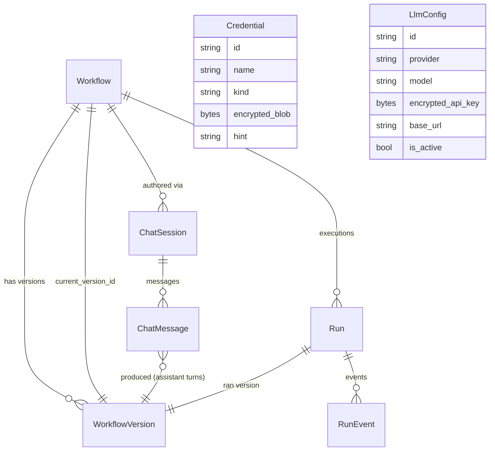
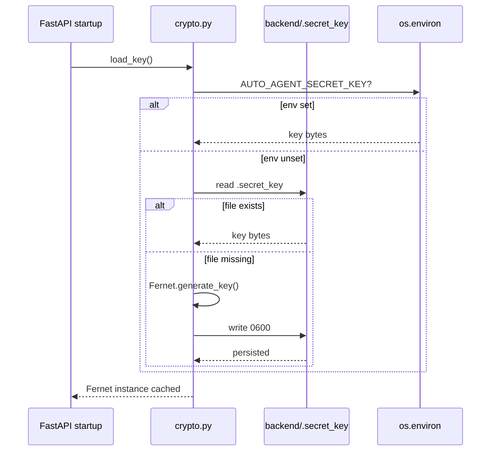
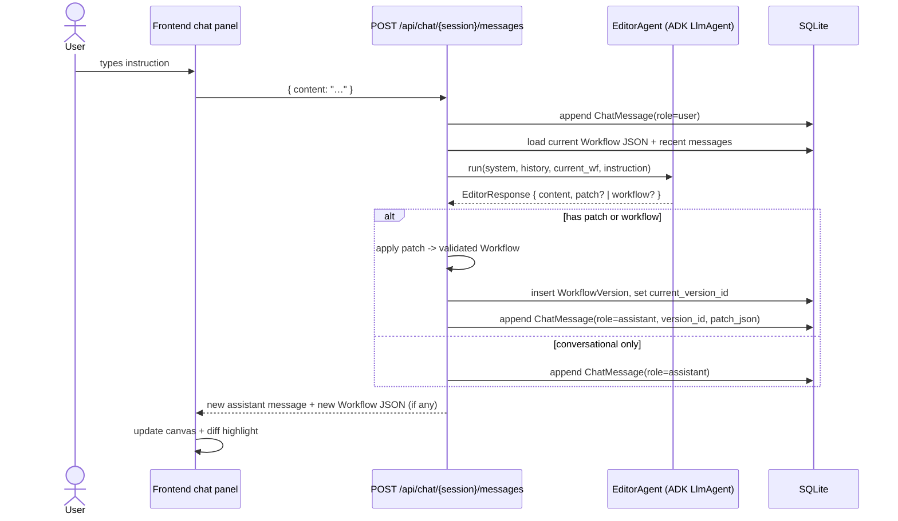
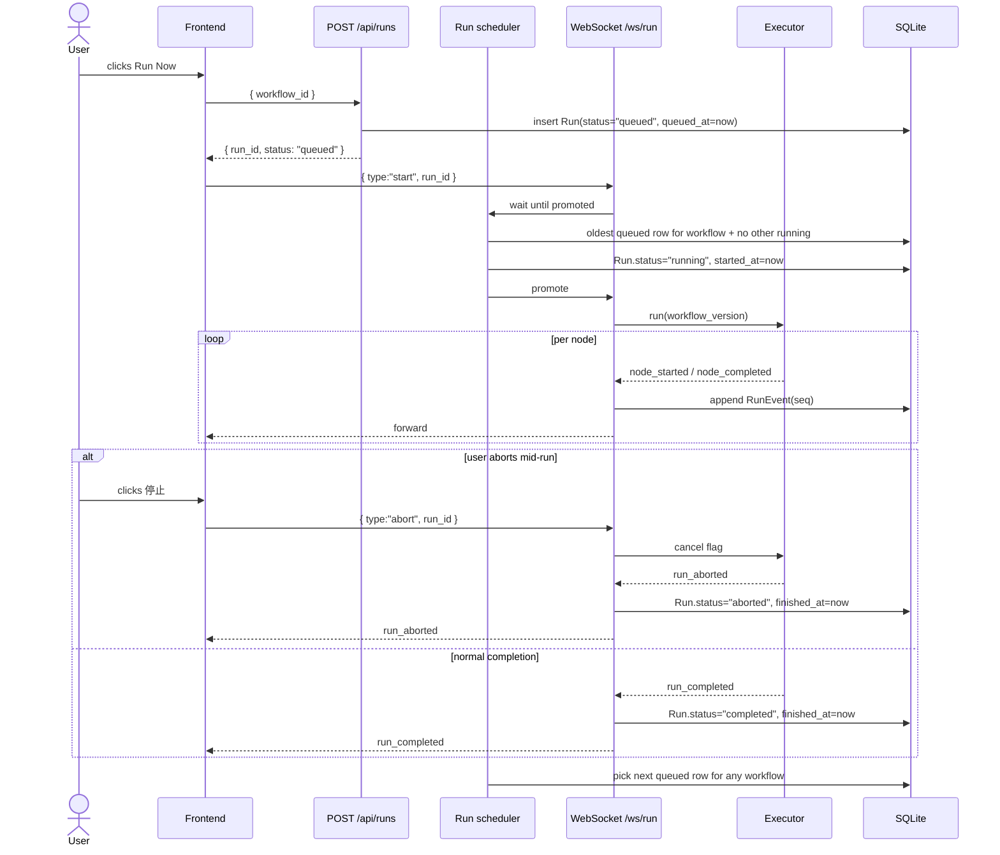

## Context

The MVP keeps the `Workflow` JSON in memory (zustand on the frontend, transient inside the FastAPI process on the backend) and rebuilds the planner / executor / fuzzy agent on every call. To become a platform we need durable workflows, a chat-shaped editor for them, encrypted credentials, a queryable run history, and runtime-editable LLM config — all without disturbing the loop the MVP already proved (`Workflow` JSON → canvas glow → headed Chromium).

Target stays Windows 11, Python 3.11+, Node 22, single user, local install. Concurrency stays at one **active** run at a time because the headed Chromium singleton is still process-wide; subsequent run requests are **queued** FIFO per workflow rather than rejected.

## Goals / Non-Goals

**Goals:**
- Persist all platform state in a single SQLite file owned by the backend process.
- Author workflows by multi-turn chat. Each turn produces either a structured patch over the current `Workflow` JSON or a full replacement, applied atomically and snapshotted as a new `WorkflowVersion`.
- Store credentials encrypted at rest; expose them to executor nodes by name; never return plaintext over the API.
- Replay any past run on the canvas using the same event-driven UI code the live runner uses.
- Edit LLM provider, model, base URL, and API key from the web UI; hot-swap the cached ADK model object on activation; never restart the process to change models.
- Leave room for future `owner_id` on every relevant table (column reserved but defaulted, indexes shaped so adding the filter later is cheap).

**Non-Goals:**
- Auth, sessions, multi-user. Single local user, trusted machine.
- Concurrent **active** runs. Single Chromium tab is still the bottleneck; concurrent run requests are queued, not executed in parallel.
- Sync to remote secrets managers. Fernet on disk is enough for a local platform.
- Editor agent that calls external tools mid-conversation. The editor only emits a patch; tools (the browser) only run when the user clicks "Run".
- Streaming the editor agent's response token-by-token; we return the full assistant message at once.

## Decisions

### 1. SQLite + SQLModel, one file under `backend/data/`

- File: `backend/data/auto_agent.db`. Directory gitignored.
- ORM: `sqlmodel` (= `SQLAlchemy 2` + `pydantic v2`). Same shape as our schemas, so the canonical `Workflow` JSON model can be reused as a column type via `Field(sa_column=Column(JSON))`.
- One `engine` created at app startup with `connect_args={"check_same_thread": False}`. Sessions are scoped per-request via a FastAPI dependency `get_session()`.
- Schema is created on startup with `SQLModel.metadata.create_all(engine)`. No Alembic for the POC — the platform is single-user and we own the only DB.
- Every table that represents user-owned data carries a reserved `owner_id: str | None = None` column. Default `None`, indexed via composite indexes that include it where it will eventually matter (`Workflow`, `Credential`, `LlmConfig`, `Run`).

### 2. Entity model



Notes:

- `Workflow.current_version_id` is a soft pointer to the latest `WorkflowVersion`; **every chat-driven edit appends a new version row and we keep all of them forever**. There is no retention policy — this is intentional simplicity for a SQLite-backed single-user platform; if the DB ever grows uncomfortably the user can rebuild it.
- `WorkflowVersion.workflow_json` stores the full `Workflow` shape (the MVP schema, unchanged) — this is the contract the executor reads.
- `ChatMessage.role ∈ {"user", "assistant", "system"}`. Assistant messages may carry both a human-readable `content` (markdown) and a `patch_json` field; when applied they point to the resulting `WorkflowVersion`.
- `RunEvent.payload_json` stores the **exact** JSON frame that was sent over `/ws/run`, so replay is byte-for-byte identical to the live run.
- `Credential.kind` enumerates rough categories (`"login"`, `"api_key"`, `"token"`, `"other"`) for UI grouping; the encrypted blob carries the actual fields (e.g. `{"username":"x","password":"y"}`).
- `LlmConfig` allows multiple rows; exactly one is `is_active=True` at any time. A unique partial index enforces this in SQLite via `CREATE UNIQUE INDEX ... WHERE is_active = 1`.

### 3. Credential vault: Fernet, with key bootstrap

- Library: `cryptography.fernet.Fernet`. AES-128-CBC + HMAC-SHA256; rotation-friendly (`MultiFernet` if we ever need it).
- Key resolution order on startup:
  1. Env var `AUTO_AGENT_SECRET_KEY` if set (Fernet-compatible base64-encoded 32-byte key).
  2. File `backend/.secret_key` if it exists.
  3. Generate a fresh key with `Fernet.generate_key()`, write to `backend/.secret_key`, and on POSIX `chmod 0600`. On Windows we log a warning and rely on the default ACL of the user profile.
- The key is loaded once into `app/services/crypto.py::_fernet`. All `Credential` and `LlmConfig` reads/writes go through `encrypt(plaintext: bytes) -> bytes` / `decrypt(blob: bytes) -> bytes`.
- API response shapes never include plaintext. `Credential` reads return `{id, name, kind, hint, masked_value}` where `masked_value` is `"••••"` (or last-4 if `hint == "show_last_4"`). `LlmConfig` reads return `api_key_masked = "sk-…AbCd"`.



Credential lookup at executor time: a node's `params` may contain a string of the form `{{cred.<name>.<field>}}` (e.g. `{{cred.bosch-corp-login.password}}`). The interpolation syntax is locked at `{{cred.<name>.<field>}}` (whitespace tolerated inside the braces). A small interpolation pass in `app/services/credential_interpolation.py::resolve_params(params, session)` walks the params tree (strings, lists, nested dicts) and substitutes those tokens with the decrypted field values right before the executor invokes the node. Unknown credential names or fields MUST fail the node loudly via a `ValueError` translated into a `node_failed` event whose `error` text identifies the missing token without leaking any sibling values. Recommended field names are `username`, `password`, `email`, `api_key`, `totp_secret`, plus arbitrary user-defined keys.

### 4. Chat-authoring: editor agent + patch ops

- A new `EditorAgent` lives in `backend/app/agents/editor.py`, alongside `planner.py` and `fuzzy.py`. It is an ADK `LlmAgent` with `output_schema=EditorResponse`.
- `EditorResponse` (pydantic):
  - `content: str` — assistant prose displayed in the chat (Chinese or English; mirrors the user).
  - `patch: list[PatchOp] | None` — preferred shape; when present, applied to the current `Workflow` JSON to produce the next version.
  - `workflow: Workflow | None` — full replacement; used when the diff is too large to express as a patch or when the editor is creating the workflow from scratch.
  - At most one of `patch` / `workflow` is non-null per assistant turn. If both are null, no version is produced (purely conversational turn).
- Patch op set:
  - `{op: "add_node", node: Node}`
  - `{op: "remove_node", id: str}` (also removes incident edges)
  - `{op: "update_node", id: str, patch: dict[str, Any]}` (deep-merges into `params` if `patch.params` is provided; replaces `label` and `type` if provided)
  - `{op: "add_edge", edge: Edge}`
  - `{op: "remove_edge", id: str}`
  - `{op: "set_start", id: str}`
- Patch application (`app/services/patch.py`) is atomic: a copy is made, ops are applied in order, the result is re-validated against `Workflow`, and only then committed as a new `WorkflowVersion`. On any error the chat turn is saved with `patch_json` but `workflow_version_id=null` and the assistant message is annotated with the validation error so the user can ask the editor to retry.
- Conversation context per turn: system prompt (editor mode) + a window of the last N messages (default 20, trimmed by char budget) + the current `Workflow` JSON serialized + the new user message.



### 5. Run history: persist the event stream verbatim, queue concurrent requests, allow abort

- `POST /api/runs { workflow_id, version_id? }` creates a `Run` row and returns `{ run_id, status }`. If no other run for that workflow is currently `running` it lands in `status="queued"` and is immediately promoted by the queue scheduler (see below); otherwise it stays `queued` until its turn. If `version_id` is omitted the current `workflow.current_version_id` is used.
- **Queue model**: rows in the `Run` table with `status="queued"` ARE the queue — there is no separate queue table. FIFO is enforced per workflow by ordering on `queued_at`. A process-wide `asyncio.Lock` around the executor guarantees at most one `running` row exists across the whole backend (still bound by the single Chromium tab). When the running row reaches a terminal state, the scheduler picks the oldest `queued` row for the same workflow and transitions it to `running`. A run dequeued before it starts (e.g. user cancels from the UI before pickup) transitions `queued → aborted` directly.
- **Run lifecycle**: `queued → running → completed | failed | aborted`. Direct `queued → aborted` is allowed when the user aborts before pickup.
- `WebSocket /ws/run` client frames:
  - `{ type: "start", workflow: Workflow }` — unchanged ephemeral path (used by demo and backward compatibility); never queued, never persisted.
  - `{ type: "start", run_id: str }` — persisted path. The server loads the `Run`, waits (still on the socket) until the queue scheduler promotes that run to `running`, hydrates the `WorkflowVersion`, persists every emitted event into `RunEvent` rows in order, and forwards each one to the socket.
  - `{ type: "abort", run_id?: str }` — sets a cancel flag on the executor. The currently executing node attempts cleanup (cancel pending Playwright actions). The run terminates with `status="aborted"`, a `run_aborted` event is emitted to the socket and persisted, and the queue scheduler advances. If the abort frame omits `run_id`, the server aborts the run associated with this socket. If the addressed run is still `queued`, the server transitions it directly to `aborted` and emits `run_aborted` once.
- Persistence shape: `RunEvent(id, run_id, seq, ts, event_type, node_id, payload_json)`. `seq` is a monotonic integer per run for deterministic replay ordering even when timestamps collide. Event types include `run_queued | run_started | node_started | node_progress | node_completed | node_failed | run_completed | run_failed | run_aborted`.
- On `run_completed` / `run_failed` / `run_aborted` the server sets `Run.status` to the matching terminal value and writes `finished_at`. WebSocket disconnect mid-run without an abort frame still sets `status="aborted"` for the persisted run (network drop is treated as an implicit abort).
- Replay: `GET /api/runs/{id}` returns `{ run, workflow_version, events: RunEvent[] }`. The frontend reuses `store.applyEvent()` to drive `GlowNode` states from stored events. A small replay player schedules events by `seq` with optional speed control (instant, 1×, 2×); the `wait` node delays don't replay (we don't want a 30-second replay).
- Failure isolation: a DB write error during event persistence does not break the socket. The persistence step is `try / except / log`; the live stream is the source of truth, the DB is best-effort with single-writer.
- UI: the runs list shows queued rows with their `queued_at` timestamp and a "stop" button (`停止`) that posts a WebSocket abort frame for the active run or sends `POST /api/runs/{id}/abort` shortcut for a queued one. The workflow detail page surfaces queue position when the current workflow has runs ahead of it.



### 6. Runtime LLM config: hot-swap the model cache

- The MVP's `get_adk_model()` reads `settings` (a `pydantic-settings` instance) once at call time and instantiates a fresh ADK model. We replace that with a memoized version keyed by the active `LlmConfig` row.
- There is **exactly one active `LlmConfig`** at any time. The same model object is used by the planner, the editor, the fuzzy agent, and the extractor — there are no per-purpose model fields and no plan to add any.
- New layer (`app/services/llm_settings.py`):
  - `effective_settings() -> EffectiveLlmSettings` — looks for the row where `is_active=True`. **All-or-nothing precedence**: that row is accepted only if every required field is present (`provider`, `model`, `api_key_ciphertext`; `base_url` is optional). If any required field is missing, the row is refused entirely and `.env` is used as the fallback in full; a warning is logged at startup. Per-field merging between the DB row and `.env` is explicitly forbidden.
  - `get_adk_model_cached()` — `@lru_cache(maxsize=1)` keyed by a tuple `(provider, model, base_url, api_key_fingerprint)` from `effective_settings()`. Returns the same ADK model object for repeat calls.
  - `invalidate_model_cache()` — clears the lru_cache; called whenever any `LlmConfig` row is created, updated, activated, or deleted.
- The existing `app/agents/model.py::get_adk_model()` becomes a one-liner that delegates to `llm_settings.get_adk_model_cached()`, preserving its current callers (planner, fuzzy, editor, extractor).
- API key bytes are decrypted lazily inside `effective_settings()`; the masked form is what the API returns.

### 7. Frontend page structure

```mermaid
graph TD
    A[App shell: sidebar + outlet] --> B[/workflows]
    A --> C[/workflows/:id]
    A --> D[/credentials]
    A --> E[/runs]
    A --> F[/runs/:id]
    A --> G[/settings]
    C --> C1[Canvas: existing WorkflowCanvas]
    C --> C2[Chat panel]
    C --> C3[Run log]
    F --> F1[Canvas: replay-driven]
    F --> F2[Event timeline]
```

- Routing: `react-router-dom` v6. `App.tsx` becomes the shell (sidebar nav + `<Outlet/>`). The existing single-page layout becomes the `WorkflowDetailPage` body.
- State: `zustand` store split. Existing `useStore` (workflow + nodeStates + logs) becomes per-workflow-detail-page state. New `usePlatformStore` for sidebar collapsed state and active route metadata; lists are fetched on each page mount with simple `useEffect` + `fetch`, no global cache layer for the POC.
- The chat panel is a self-contained component owning its own message reducer and request lifecycle; it dispatches `setWorkflow(newJson)` into the canvas store when the editor returns a new version.

### 8. API surface

| Method | Path | Request body | Response | Notes |
| --- | --- | --- | --- | --- |
| `GET` | `/api/health` | — | `{ok:true}` | unchanged |
| `GET` | `/api/sample-workflow` | — | `Workflow` | unchanged |
| `POST` | `/api/workflow/generate` | `{description}` | `Workflow` | now also creates `Workflow` + `WorkflowVersion` + `ChatSession`; response wraps with `{workflow_id, workflow}` |
| `GET` | `/api/workflows` | — | `WorkflowSummary[]` | list with name, updated_at, last_run_status |
| `POST` | `/api/workflows` | `{name, description?}` | `Workflow row + initial empty version` | manual create |
| `GET` | `/api/workflows/{id}` | — | `{workflow_meta, version, chat_session_id}` | detail |
| `PUT` | `/api/workflows/{id}` | `{name?, description?}` | meta | rename / re-describe |
| `DELETE` | `/api/workflows/{id}` | — | `{ok:true}` | cascades to versions/sessions/runs |
| `GET` | `/api/workflows/{id}/versions` | — | `WorkflowVersionSummary[]` | for revert UI (out of scope for shipping but the endpoint is included) |
| `GET` | `/api/chat/{session_id}` | — | `{messages: ChatMessage[]}` | full history |
| `POST` | `/api/chat/{session_id}/messages` | `{content}` | `{assistant_message, new_version?}` | editor turn |
| `GET` | `/api/credentials` | — | `Credential[]` (masked) | |
| `POST` | `/api/credentials` | `{name, kind, fields: dict}` | `Credential` (masked) | encrypts `fields` on write |
| `PUT` | `/api/credentials/{id}` | `{name?, kind?, fields?}` | `Credential` (masked) | partial update |
| `DELETE` | `/api/credentials/{id}` | — | `{ok:true}` | |
| `POST` | `/api/runs` | `{workflow_id, version_id?}` | `{run_id, status}` | creates queued Run (immediately promoted to running if no other run is active); client then opens `/ws/run` |
| `GET` | `/api/runs` | `?workflow_id=` | `RunSummary[]` | recent runs incl. queued |
| `GET` | `/api/runs/{id}` | — | `{run, workflow_version, events}` | replay payload |
| `POST` | `/api/runs/{id}/abort` | — | `RunOut` | shortcut for abort; equivalent to the `{type:"abort", run_id}` WS frame. Used for queued runs and as a fallback when no socket is open. |
| `GET` | `/api/llm-config` | — | `LlmConfig[]` (masked) | |
| `POST` | `/api/llm-config` | `{provider, model, api_key, base_url?}` | `LlmConfig` (masked) | encrypts api_key |
| `PUT` | `/api/llm-config/{id}` | partial | `LlmConfig` (masked) | invalidates model cache if active |
| `DELETE` | `/api/llm-config/{id}` | — | `{ok:true}` | refuses if it is the only active row and `.env` has no usable provider |
| `POST` | `/api/llm-config/{id}/activate` | — | `LlmConfig` (masked) | sets is_active, clears others, invalidates cache |
| `GET` | `/api/llm-config/effective` | — | `EffectiveLlmSettings` (masked) | shows which row (or `.env`) is currently in use |
| `WS` | `/ws/run` | `{type:"start", workflow}` or `{type:"start", run_id}` or `{type:"abort", run_id?}` | event frames | persisted variant when `run_id` is given; abort frame sets the cancel flag and terminates the run with `status="aborted"` |

### 9. Backwards compatibility with the MVP

- `GET /api/sample-workflow`, `POST /api/workflow/generate`, and `WebSocket /ws/run` keep their HTTP shapes. `generate` returns the `Workflow` JSON it always did, with `workflow_id` added; the frontend can ignore the new field on a stale build.
- The existing canvas glow loop is identical: stored events are the same JSON the live stream sends. The frontend's `applyEvent()` handles both unchanged.

## Risks / Trade-offs

- **Patch quality**: small models may emit invalid patches (referencing missing node ids). Mitigation: full re-validation against `Workflow` after patch application; failed turns surfaced in chat with the validation error so the user can ask the editor to retry. The editor's system prompt includes the current `Workflow` JSON, so it can resolve ids.
- **Chat context growth**: long conversations balloon the prompt. Mitigation: trim to last 20 messages by default plus a char budget; the current `Workflow` JSON is the source of truth, not the message scrollback.
- **Concurrent run requests**: still one browser tab. `POST /api/runs` always enqueues; a process-wide `asyncio.Lock` around the executor guarantees a single `running` row at a time, and a FIFO scheduler promotes the next queued row when the current one terminates. UI exposes the queue.
- **Secret-key loss**: if `backend/.secret_key` is deleted, all encrypted blobs become unreadable. Mitigation: README warns explicitly; future work could add a backup/export flow.
- **Windows file ACLs**: `chmod 0600` is a no-op on Windows. Mitigation: documented in README; default location is inside the user's workspace, so per-user ACLs apply.
- **DB migrations**: greenfield SQLite, no Alembic. If a future change adds a column we either rebuild the DB or hand-write an `ALTER TABLE`. Acceptable for a single-user local platform.
- **Replay timing**: replaying real `wait` durations would be slow. We collapse `wait` delays to 0 ms during replay, which means timestamps in the playhead differ from live runs. Documented in the run-history spec.
- **`output_schema` for `EditorResponse`**: same drift risk as the MVP planner; we keep the JSON-mode fallback in `app/services/llm_settings.py::invoke_structured()` shared with the planner.

## Migration Plan

N/A — this is the first persistent build. First boot creates `backend/data/auto_agent.db` and `backend/.secret_key`. Users with an `.env`-based LLM setup keep working: `effective_settings()` falls back to `.env` until they create an `LlmConfig` row.

## Resolved Decisions

The six original open questions were closed by the user before implementation. They are baked into the architecture sections above; recorded here for traceability:

1. **Concurrent run policy** → QUEUE (FIFO per workflow). `POST /api/runs` always succeeds with `status="queued"`; the scheduler promotes the next row to `running` when the current one terminates. UI surfaces the queue.
2. **Workflow version retention** → KEEP ALL. Every chat-driven edit persists a new `WorkflowVersion`; no retention policy. Intentional simplicity for a SQLite-backed single-user platform.
3. **Editor vs planner model** → SINGLE active `LlmConfig`. The same model object is used by planner, editor, fuzzy, and extractor. No per-purpose model fields.
4. **Credential interpolation syntax** → `{{cred.<name>.<field>}}`. Walks `Node.params` (strings, lists, nested dicts), substitutes tokens just before executor invokes the node. Unknown name or field MUST fail the node loudly.
5. **Settings precedence on partial DB row** → ALL-OR-NOTHING. The active `LlmConfig` row is accepted only if `provider`, `model`, and `api_key_ciphertext` are all present (`base_url` is optional). If any required field is missing, the row is refused entirely and `.env` is the complete fallback; a warning is logged at startup. No per-field merging.
6. **Run abort** → INCLUDED. `/ws/run` accepts `{type:"abort", run_id?}`; backend sets cancel flag, current node cleans up (cancel pending Playwright actions), executor terminates with `status="aborted"`, persists `run_aborted`, scheduler advances. Mirror REST endpoint `POST /api/runs/{id}/abort` is provided for queued runs and as a no-socket fallback. UI exposes a "停止" button while a run is `queued` or `running`.
