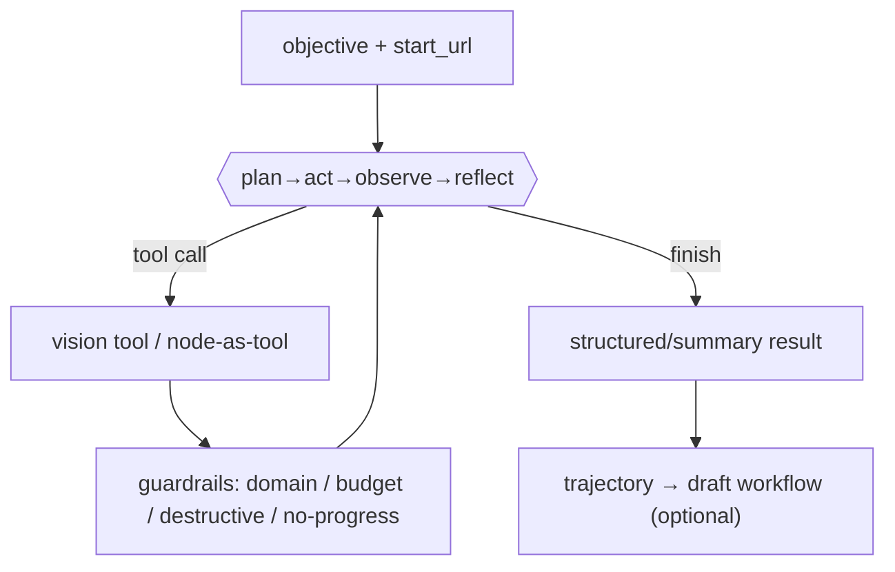

## Context

`vision-action-mode` gives auto-agent per-step vision: perceive a page (screenshot + accessibility tree + indexed elements), decide one action, execute it. But it still runs inside a pre-authored graph. Skyvern's flagship experience is graph-free: a goal + URL, and the agent figures out the steps. This change adds that autonomous loop on top of the vision primitives, with bounded memory, guardrails, and a synthesizer that turns a successful run into a reusable workflow.

## Goals / Non-Goals

**Goals**
- A graph-free `autonomous` run mode: objective in, structured/summary result out.
- A bounded plan-act-observe-reflect loop with working memory + compaction.
- A superset tool surface (vision tools + deterministic nodes as tools).
- Hard guardrails: domain allowlist, step/time budgets, destructive-action confirmation, no-progress detection.
- Synthesize a draft reusable workflow from a successful trajectory.

**Non-Goals**
- Multi-agent / sub-agent orchestration.
- Cross-task learning / persistent skills.
- CAPTCHA solving.
- Replacing the deterministic graph engine.

## Decisions

### Decision 1: The loop

```python
# app/agents/autonomous.py
async def run_task(task: TaskSpec, emit) -> TaskResult:
    memory = Memory(objective=task.objective, plan=[])
    for step in range(task.max_steps):
        if deadline_exceeded(task): break
        obs = await perceive(page, memory)            # vision-action-mode perception + memory summary
        decision = await llm_decide(obs, tools)        # next tool call or finish
        emit("vision_step" | "task_plan_updated", ...)
        if decision.is_finish:
            return finalize(decision, task.data_schema)
        result = await execute_tool(decision)          # vision tool OR node-as-tool
        memory.record(decision, result)
        if no_progress(memory): abort_with_diagnostic()
        if reflect_due(step): memory.plan = await llm_reflect(memory)  # replan
    return budget_exhausted_result(memory)
```

The LLM is asked, each step, for exactly one tool call from the tool surface, given the observation + a compacted memory + the current plan. `finish` is itself a tool. Reflection runs every K steps (or on repeated failure) to re-plan.

### Decision 2: Working memory + compaction

`Memory` holds: the objective, the evolving plan (a todo list of subgoals with status), the last N raw observations, a rolling list of extracted facts/data items, and the set of visited URLs. When the serialized memory would exceed a token budget, older steps are compacted into an LLM-written summary ("steps 1–12: logged in, navigated to orders, found 3 matching items"). This keeps long runs within the context window while preserving the through-line.

### Decision 3: Tool surface = vision tools + node-as-tool

The agent's callable tools are: the `vision-action-mode` set (`click_element`, `type_text`, `select_option`, `scroll`, `go_back`, `wait`, `extract`, `done`/`finish`) PLUS a curated set of deterministic nodes exposed as tools — `http_request`, `extract` (schema), the data-transform ops, and `integration` (when configured). A node-as-tool call runs the same node executor used in graphs, so behaviour is identical and reusable in synthesis (Decision 6). The tool schema given to the LLM is generated from the node params models.

### Decision 4: Guardrails are first-class and enforced outside the LLM

- **Domain allowlist**: every navigation/`http_request` target host is checked against `allowed_domains`; a violation fails the step with `"navigation to <host> blocked (not in allowed_domains)"` and the agent must choose another action (or finish).
- **Budgets**: `max_steps` and `max_seconds` are hard caps enforced by the loop, not the LLM.
- **Destructive-action gate**: when `require_confirmation`, an action classified as destructive (submitting forms matching purchase/delete/payment heuristics, or any `integration` write) pauses via `human-in-the-loop` and resumes only on approval.
- **No-progress detection**: if M consecutive steps produce no observable state change (same URL + same element map hash + no new data), the loop aborts with a diagnostic listing the repeated action, preventing infinite "click the same disabled button" loops.

### Decision 5: Result contract

- With `data_schema`: `finish` must provide data validated against the schema; a validation failure prompts one corrective retry, then fails the task with the validation error.
- Without `data_schema`: the result is `{success, summary, items}` where `items` are everything the agent `extract`ed during the run.

### Decision 6: Trajectory → workflow synthesis

After a successful run, the synthesizer walks the recorded trajectory and emits a draft graph: `start → [navigate/vision_navigate per URL goal] → [vision_act/click/fill per action] → [extract/data nodes] → end`, collapsing repeated vision steps into a `vision_navigate` with the inferred goal where deterministic selectors were not stable. The draft is saved as a normal workflow (status "draft") the user can edit, test, and schedule. Synthesis is best-effort and clearly labelled as a starting point, not a guaranteed-equivalent replay.



## Risks / Trade-offs

- **Cost / runaway**: an autonomous loop is the most expensive mode. Mitigation: mandatory budgets, no-progress detection, per-step event visibility so an operator can abort.
- **Safety of destructive actions**: heuristic destructive-action classification can miss. Mitigation: `require_confirmation` plus `allowed_domains` plus the fact that `integration` writes always gate; documented that fully unattended destructive automation is not a v1 goal.
- **Synthesis fidelity**: a synthesized graph may not reproduce the run on a changed page. Mitigation: label as draft, prefer vision nodes where selectors were unstable, require the user to test before scheduling.
- **Memory compaction loss**: summarization can drop a detail the agent later needs. Mitigation: keep extracted data items verbatim (never summarized away); only narrative steps are compacted.
- **Overlap with the planner**: two ways to "describe a task". Mitigation: the planner prompt routes open-ended objectives to autonomous mode and repeatable pipelines to graph generation; the UI presents them as distinct surfaces.

## Migration Plan

- Additive run `mode` column (default `graph`).
- New `POST /api/tasks` + task run records; graph runs unchanged.
- Land after `vision-action-mode`; integrate `human-in-the-loop` for the confirmation gate.

## Open Questions

- Should node-as-tool availability be operator-configurable per task (e.g. disable `integration` writes)? Leaning yes via an `allowed_tools` field on `TaskSpec`; default to read-only browser+extract+http for safety.
