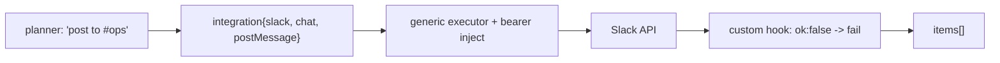

## Context

`integration-node-framework` defines descriptors, the generic executor, typed credentials, and OAuth2. This change is almost entirely *data*: four app descriptors + credential types + fixtures. The design work is choosing the operation set per app, mapping each provider's response shape into the framework's `ResponseMap`, and identifying the few quirks that need a custom hook.

## Goals / Non-Goals

**Goals**
- Four working apps that prove the framework: Slack, Gmail, Google Sheets, Notion.
- High-value operations per app (send/post, list, get, append/create), not full API parity.
- Correct OAuth2 credential types and response maps incl. pagination.
- Fixture-tested without live accounts.

**Non-Goals**
- Triggers (`polling-and-app-triggers`).
- Full provider API coverage.
- Apps beyond the curated four.

## Decisions

### Decision 1: Operation set per app (high-value first)

| App | Operations |
|---|---|
| Slack | `chat.postMessage`, `conversations.list`, `conversations.history`, `users.list`, `files.upload` |
| Gmail | `messages.send`, `messages.list`, `messages.get`, `drafts.create`, `labels.list` |
| Google Sheets | `values.get`, `values.append`, `values.update`, `values.clear`, `spreadsheets.create` |
| Notion | `pages.create`, `pages.retrieve`, `databases.query`, `blocks.children.append`, `databases.retrieve` |

Each list operation declares pagination; each create/send declares `root_path` to emit the created object as one item.

### Decision 2: Credential types

- **Slack**: OAuth2 (authorize `https://slack.com/oauth/v2/authorize`, token `https://slack.com/api/oauth.access`), bot scopes per operation set; bearer injection.
- **Gmail**: Google OAuth2 (`https://accounts.google.com/o/oauth2/v2/auth`, token `https://oauth2.googleapis.com/token`), scope `gmail.modify`/`gmail.send`; bearer.
- **Google Sheets**: Google OAuth2, scope `spreadsheets`; bearer. Shares the Google OAuth2 client config pattern with Gmail (two credential types, same provider endpoints).
- **Notion**: OAuth2 (`https://api.notion.com/v1/oauth/authorize`, token `https://api.notion.com/v1/oauth/token`) OR an internal-integration token (API-key bearer) for simpler setup; bearer + the required `Notion-Version` header injected via the descriptor.

### Decision 3: Response maps + quirks

- **Slack**: success envelope is `{ok: true, ...}` / `{ok: false, error: "..."}` with HTTP 200 even on logical errors. A small **custom hook** maps `ok:false` to a node failure naming `error`. `conversations.list`/`history` paginate via `response_metadata.next_cursor`. `item_path` = the relevant array (`channels`, `messages`, `members`).
- **Gmail**: `messages.list` returns `{messages:[{id,threadId}], nextPageToken}`; pagination via `pageToken`. `messages.get` returns one object (`root_path`). `messages.send` takes a base64url RFC822 body — a custom hook builds the MIME from friendly fields (to/subject/body).
- **Google Sheets**: `values.get` returns `{values: [[...]]}`; a custom hook can optionally turn rows into objects using the header row. A1 range building from friendly `sheet`+`range` fields via a hook. `append`/`update` return the update summary (`root_path`).
- **Notion**: `databases.query` paginates via `next_cursor`/`has_more`; `item_path` = `results`. Requires `Notion-Version` header (descriptor-injected). `pages.create` returns the page (`root_path`).

Quirk hooks live in `app/integrations/<app>/custom.py` and are the documented escape hatch from `integration-node-framework`; everything else is declarative.

### Decision 4: Fixture-first testing

Each operation gets a recorded HTTP fixture (request matcher → canned response) so descriptor + mapping are tested in CI without credentials. A separate, manual `LIVE_SMOKE.md` per app lists the minimal real-credential checks (connect, one send, one list) for release verification.

## Risks / Trade-offs

- **Provider drift**: APIs change; fixtures can go stale. Mitigation: pin descriptor `version`, keep fixtures minimal, document the live-smoke checklist.
- **Scope sprawl**: four apps × ~5 operations is sizable. Mitigation: declarative descriptors keep per-operation cost low; custom hooks are the exception, not the rule.
- **OAuth app registration burden**: each provider needs a registered OAuth app (client id/secret). Documented as operator setup; the credential UI links to each provider's app-creation page.
- **Google two credential types**: Gmail and Sheets are separate scopes/credentials despite one provider. Accepted for clarity; a shared Google OAuth2 base reduces duplication.

## Migration Plan

- Additive descriptors; no migration beyond the framework's.
- Land after `integration-node-framework`. Each app can ship independently (separate capabilities) so the change can be split if needed.

## Open Questions

- Confirm the four-app list with the user (see proposal "Decision needed"). Substitutions (Airtable/Discord/Telegram/GitHub) are spec-time swaps.
- Notion: ship OAuth2, internal-integration-token, or both in v1? Leaning both (token is far simpler for solo operators).
