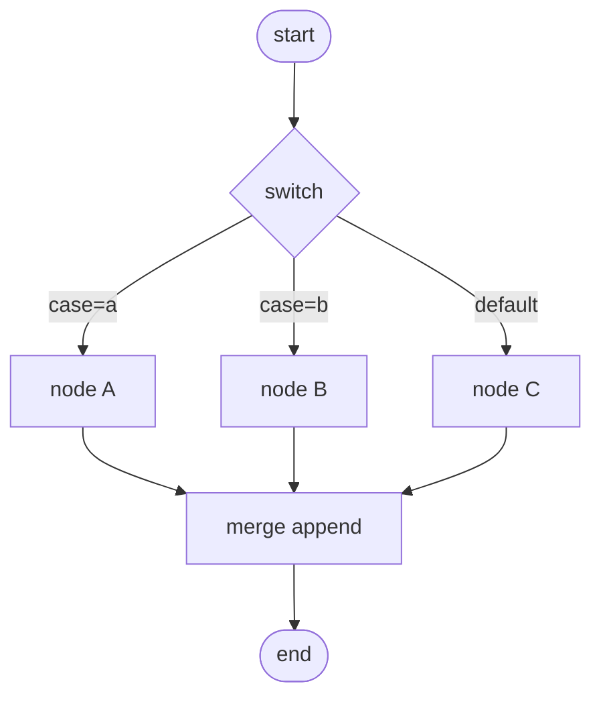

## Context

`run_workflow` in [backend/app/executor.py](backend/app/executor.py) walks a single `current_id`, picks one outgoing edge via `_pick_next_edge`, and uses a `visited` set that aborts on any revisit. This cannot express fan-in (a `merge` with two parents would be "revisited") or multi-way branching. We replace the walk with a DAG scheduler and add `switch`/`merge`, while preserving every per-node behaviour (interpolation, retry/on-error, events, context).

## Goals / Non-Goals

**Goals**
- Correct execution of diamonds, multi-parent merges, and multi-way switches.
- Branch pruning so non-selected subgraphs are skipped, with the "skip only if ALL incoming pruned" rule for diamonds.
- Preserve linear + condition-only behaviour bit-for-bit.
- Keep the single-Chromium-tab invariant (sequential ready-set in v1).
- Keep `node-error-handling` working under the new scheduler.

**Non-Goals**
- True parallelism / browser pool (`concurrent-runs-browser-pool`).
- Loop nodes (owned elsewhere).
- Distributed/multi-process scheduling.

## Decisions

### Decision 1: Indegree ready-queue over active edges

```python
# app/exec/scheduler.py
# active_in[node] = set of incoming edge ids not yet resolved
# resolved = parent ran AND chose-or-pruned this edge
# a node is READY when active_in[node] becomes empty
# a node is SKIPPED when all its incoming edges are pruned (none chosen)
```

Algorithm:
1. Compute incoming-edge sets. Seed the queue with `start_id` (indegree 0).
2. Pop a ready node, resolve interpolation, run it (retry/on-error as today), store `NodeResult` in context, emit `node_completed`.
3. Determine which outgoing edges are *selected* vs *pruned* (Decision 2). For each outgoing edge: mark it resolved on the target; if selected, it counts toward the target running; if pruned, it counts as pruned.
4. A target with all incoming edges resolved becomes ready IF at least one was selected; otherwise it is skipped (emit `node_skipped`) and its outgoing edges are all marked pruned (skip propagates).
5. Continue until the queue drains. Emit `run_completed`.

Determinism: when multiple nodes are ready, run in ascending topological rank then `node_id` to make runs reproducible and preserve the single-tab ordering users see today.

### Decision 2: Edge selection per node type

- Plain node (one or more outgoing `kind="next"` edges, no `when`/`case`): ALL outgoing `next` edges are selected (normal fan-out). This matches today's "follow the edge" for the linear case (exactly one edge) and enables explicit fan-out.
- `condition`: selects the `when` edge matching the boolean result (`"true"`/`"false"`), prunes the other; default-true fallback preserved.
- `switch`: evaluates `params.expr` to a case key (string); selects the outgoing edge whose `case` equals the key; if none match, selects the edge with `case=null` (the default); if no default, the node fails with `"switch: no case matched '<key>' and no default edge"`.
- on-error (`node-error-handling`): when a node fails with `on_error="branch"`, the `kind="on_error"` edge is selected and `kind="next"` edges are pruned; `on_error="continue"` selects `next` with the error-output; `fail_run` aborts the run (emit `run_failed`).

### Decision 3: `merge` waits for required parents

`merge` is the only node that legitimately has indegree > 1 with multiple SELECTED parents. The scheduler treats `merge` specially: it becomes ready when all of its *non-pruned* incoming edges are resolved (their parents completed). Modes:
- `append`: output items = concatenation of all arrived parents' items, in parent edge order.
- `merge_by_key`: join arrived parents' items on `params.key`; output one item per key with merged json (later parents override on key collisions, documented).
- `wait_all`: wait for all parents, emit a single item whose json is `{"<parent_id>": <parent.output>, ...}`.
- `pass_through`: emit the first-arrived parent's items; still waits structurally but ignores later parents' data.

If some incoming edges to a `merge` were pruned (their branch wasn't taken), `merge` proceeds with only the arrived parents (n8n's behaviour: a merge of a skipped branch yields the live branch).



### Decision 4: `condition` becomes a 2-case switch internally

To avoid two code paths, the scheduler treats `condition` as a `switch` whose cases are `"true"`/`"false"` keyed off the boolean predicate, reading `Edge.when` instead of `Edge.case`. The public `condition` node and `Edge.when` are unchanged for back-compat; internally both route through one selection function.

### Decision 5: Cycle detection excludes loop nodes

A DAG with a back-edge that is not part of a recognised loop construct (loop nodes are owned elsewhere and carry an explicit body marker) fails validation at run start with `"cycle detected: <edge>"`. This preserves today's guarantee. Loop nodes, when they land, re-enqueue their body via a scoped sub-scheduler rather than a graph back-edge, so the top-level graph stays acyclic.

### Decision 6: Single-tab invariant preserved

Even though the scheduler can identify multiple ready nodes, v1 executes them sequentially (Decision 1 ordering). Browser nodes therefore never overlap, matching today. The scheduler exposes a seam (`async def run_ready_set(nodes)`) that `concurrent-runs-browser-pool` later swaps for bounded concurrency with a browser lock around page-touching actions.

## Risks / Trade-offs

- **Behavioural drift on edge cases**: the rewrite must reproduce today's linear/condition semantics exactly. Mitigation: a regression suite that runs the seeded sample + Apple workflows + condition-branch fixtures and asserts identical event sequences (modulo new event types).
- **Merge-of-pruned-branch semantics**: we choose "proceed with arrived parents" (n8n-like). Documented; tested.
- **Determinism vs latency**: sequential ready-set is slower than parallel but preserves the single-tab contract and reproducibility. Concurrency is a deliberate later change.
- **Author confusion (fan-out)**: a plain node with two `next` edges now runs BOTH targets (fan-out), whereas today the walker followed `outgoing[0]`. This is a behaviour change for any multi-`next` graph. Mitigation: today's authored graphs are linear/condition-only (verified against seeded + Apple workflows); the planner/editor prompt documents fan-out explicitly.

## Migration Plan

- No DB migration; `switch`/`merge`/`Edge.case` live in `workflow_json`; events are additive.
- Land after `items-data-model`. Co-verify with `node-error-handling` fixtures.
- Ship the regression suite asserting linear/condition parity before enabling fan-out in the planner prompt.

## Open Questions

- Should a plain node with multiple `next` edges fan out (run all) or be rejected as ambiguous? Leaning fan-out (n8n behaviour) with an editor lint that warns when fan-out is likely unintended. Final call at implementation.
