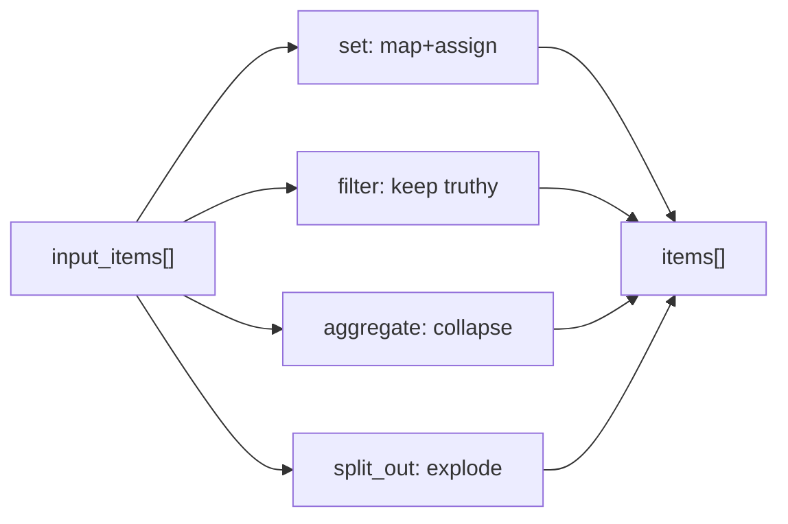

## Context

`items-data-model` makes every node emit `Item[]` and threads a predecessor's items as `input_items`. `expression-engine` lets a field be `{{= ... }}`. With both, the classic n8n data utilities become small pure functions over the item array. This change adds nine of them. They are deterministic, do no I/O, and are the highest-frequency nodes in real n8n workflows.

## Goals / Non-Goals

**Goals**
- Cover the common reshaping vocabulary: set/rename/datetime (per-item) and filter/sort/limit/aggregate/split_out/remove_duplicates (array-level).
- Reuse `expression-engine` for every computed field/predicate.
- Items-aware: read `input_items`, emit `items`; `output` = first emitted item.
- Each node is one small, well-tested module.

**Non-Goals**
- Pivot/crosstab, multi-table SQL joins (Merge covers join-by-key).
- The Code node.
- Office/spreadsheet parsing.
- Streaming/unbounded aggregation.

## Decisions

### Decision 1: One module per node, registered via the existing discriminator

```python
# app/nodes/set.py, filter.py, sort.py, limit.py, aggregate.py,
#          split_out.py, remove_duplicates.py, rename_keys.py, datetime.py
class SetParams(BaseModel):
    mode: Literal["manual"] = "manual"
    assignments: list[Assignment]          # {name, value}
    keep_only_set: bool = False
    include_binary: bool = True

async def run(params: SetParams, *, input_items: list[Item], ctx) -> list[Item]: ...
```

Each module exports a typed `Params` model and a `run(params, *, input_items, ctx)` coroutine returning `list[Item]`. The executor's dispatch maps the node `type` to the module's `run`. `ctx` carries the expression namespace builder so a field `value` of `"{{= item.json.x }}"` is evaluated per item with `item` bound to the current item.

### Decision 2: Per-item vs array-level contract

- **Per-item** nodes (`set`, `rename_keys`, `datetime`): map over `input_items`, evaluating expressions with `item` bound to each item in turn; emit one output item per input item (binary carried per `include_binary`).
- **Array-level** nodes (`filter`, `sort`, `limit`, `aggregate`, `split_out`, `remove_duplicates`): consume the whole `input_items` array and emit a possibly different-length array. For these, an expression's `item` binds to the item under consideration (filter predicate, sort key) and `items` binds to the whole input.

### Decision 3: Node-by-node semantics

- `set`: for each input item, start from a copy of `item.json` (or `{}` when `keep_only_set`), apply each assignment `name=eval(value)`; an assignment with an empty/null value and a special `__remove__` sentinel removes the key. Binary preserved when `include_binary`.
- `filter`: keep items where `eval(predicate)` is truthy. A predicate error fails the node (not the item) with the item index in the message.
- `sort`: `sorted(input_items, key=...)` stable; multiple keys applied right-to-left; `order ∈ {asc, desc}`; missing/None sorts last deterministically.
- `limit`: `keep ∈ {first, last}`, `count: int`; slices the array.
- `aggregate`: `operation ∈ {concat, sum, avg, min, max, count, group_by}`. `concat` → one item `{<out_field>: [values...]}`; numeric ops → one item `{<out_field>: <number>}`; `group_by` `key` → one item per distinct key with the grouped rows under `out_field`. Non-numeric input to a numeric op fails with a clear message naming the field and offending value.
- `split_out`: `field` names an array on the (single, or each) input item; emit one item per element, merging the element (if dict) or wrapping it (`{<out_field>: element}`) and carrying the remaining json per `include_other_fields`.
- `remove_duplicates`: `compare ∈ {all_fields, selected_fields}`, `fields: list[str]`; first occurrence wins; comparison is on a JSON-canonical tuple of the chosen fields.
- `rename_keys`: apply `{from, to}` pairs to each item's json; collisions (a `to` already present) documented as overwrite, with an optional `error_on_collision`.
- `datetime`: `action ∈ {now, parse, format, add, subtract}`; reads/writes a `field`; `format`/`parse` use explicit format strings; `add`/`subtract` take a `{value, unit}` duration. Reuses the expression engine's date helpers for consistency.

### Decision 4: Empty input and error handling

- Empty `input_items` → empty `items` out for most nodes; `aggregate` over empty input emits one item with the identity (`count`→0, `sum`→0, `concat`→[]); `datetime now` emits one item even on empty input (it is a source-ish utility).
- Field/predicate evaluation errors fail the node with an `ExpressionError`-derived message that includes the item index, integrating with `node-error-handling` (retry/on_error) unchanged.
- All nodes respect `max_items_per_node` (from `items-data-model`).



## Risks / Trade-offs

- **Expression cost per item**: `set`/`filter` evaluate an expression per item; the engine's per-expression caps bound each, and `max_items_per_node` bounds the count. Acceptable for typical sizes; documented.
- **Type coercion surprises** (sort/aggregate on mixed types): we define deterministic rules (None last; numeric ops reject non-numerics loudly) and test them, rather than silently coercing.
- **`set` remove-field ergonomics**: using a sentinel for removal is slightly awkward; we provide an explicit `fields_to_remove: list[str]` option in addition to keep the common case clean.
- **Scope creep**: nine nodes is a lot for one change. They share one module pattern and test harness, so the marginal cost per node is low; splitting into two capabilities (field-mutation vs item-list) keeps the specs cohesive.

## Migration Plan

- Additive node types; no DB migration.
- Land after `items-data-model` + `expression-engine` (+ `expanded-node-library` for the module layout).
- Editor/planner prompt catalogue ships with the backend.

## Open Questions

- Should `aggregate group_by` support multiple group keys in v1? Leaning single key in v1, multi-key as a fast-follow, to keep the first cut small.
