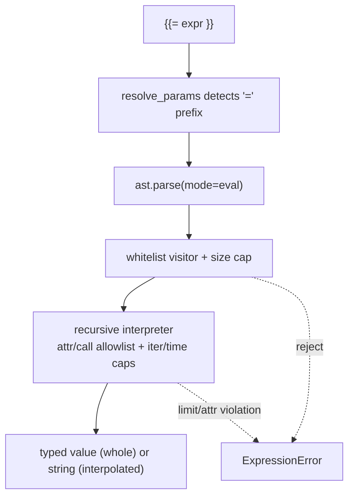

## Context

`node-context-variables` gives us `{{nodes.<id>.output.path}}` — a pure lookup, no computation. `items-data-model` gives us the item arrays expressions want to operate on. To reach n8n-level expressiveness without a Code node, we add a bounded expression evaluator. The hard constraint: it must be safe by construction. We deliberately evaluate a small whitelisted subset of Python's AST rather than building a new language or using `eval`.

## Goals / Non-Goals

**Goals**
- A `{{= <expr> }}` form that supports arithmetic, comparison, boolean logic, conditionals, indexing, comprehensions, and a curated function/method allowlist.
- Deny-by-default safety: anything not explicitly allowed is rejected at parse time.
- Bounded resource use: length, AST size, iteration, and wall-clock caps.
- Type-preserving whole-expression semantics consistent with `node-context-variables`.

**Non-Goals**
- A JavaScript engine. We expose a Python-subset; the editor prompt documents it precisely.
- Arbitrary user code / the Code node (refused on security grounds).
- Statements, assignment, loops-as-statements, imports, lambdas, walrus.
- Cross-expression state.

## Decisions

### Decision 1: `=`-prefix marks an expression; pure paths stay paths

```text
{{nodes.n1.output.price}}        # path lookup (node-context-variables) — UNCHANGED
{{= nodes.n1.output.price * 1.2 }}   # expression
{{= item.json.first + ' ' + item.json.last }}
{{= [i.json.sku for i in items if i.json.in_stock] }}
```

`variable_interpolation.resolve_params` detects a token whose first non-space char is `=`, strips it, and hands the remainder to `expressions.evaluate(expr, namespace)`. Tokens without `=` keep the existing path-resolution behaviour verbatim.

### Decision 2: AST whitelist, not `eval`

```python
# backend/app/services/expressions.py
ALLOWED_NODES = {
    ast.Expression, ast.BoolOp, ast.BinOp, ast.UnaryOp, ast.IfExp,
    ast.Compare, ast.Call, ast.Constant, ast.List, ast.Tuple, ast.Dict, ast.Set,
    ast.ListComp, ast.SetComp, ast.DictComp, ast.GeneratorExp, ast.comprehension,
    ast.Name, ast.Load, ast.Subscript, ast.Index, ast.Slice, ast.Attribute,
    ast.And, ast.Or, ast.Not, ast.Add, ast.Sub, ast.Mult, ast.Div, ast.FloorDiv,
    ast.Mod, ast.Pow, ast.USub, ast.UAdd, ast.Eq, ast.NotEq, ast.Lt, ast.LtE,
    ast.Gt, ast.GtE, ast.In, ast.NotIn, ast.keyword, ast.Starred,
}
```

A `NodeVisitor` walks the parsed tree and raises `ExpressionError` on any node type not in `ALLOWED_NODES`. `ast.Lambda`, `ast.NamedExpr` (walrus), `ast.Import`, `ast.Assign`, comprehension targets that shadow builtins, etc. are absent from the set, so they are rejected. Evaluation is a manual recursive interpreter over the allowed nodes — we do NOT call `eval`/`compile`+`exec`.

### Decision 3: Attribute access is deny-by-default

`ast.Attribute` is allowed structurally, but the evaluator resolves attributes through an allowlist:
- On a `str`: only `upper, lower, strip, lstrip, rstrip, replace, split, rsplit, startswith, endswith, title, zfill, format`.
- On a `list`/`dict`: a small read-only set (`get` for dict; no mutators).
- On the namespace roots (`nodes`, `item`, `items`, `params`, `now`): the documented accessors only.
- ANY attribute whose name starts or ends with `_` raises immediately (`__class__`, `__globals__`, `__subclasses__`, `__builtins__`, etc.).

This is the core of the safety story: even though `ast.Attribute` is in the grammar, the runtime attribute resolver refuses dunders and anything off the allowlist.

### Decision 4: Calls only to allowlisted callables

`ast.Call` is allowed, but the callee must resolve (via `ast.Name` or an allowlisted method `ast.Attribute`) to a member of `SAFE_FUNCTIONS` or the per-type method allowlist. Calling a `Name` not in `SAFE_FUNCTIONS` raises `ExpressionError("function '<n>' is not available")`. There is no way to reach `__import__`, `open`, `exec`, `eval`, `getattr`, `setattr`, `globals`, `locals` — they are not in the table.

```python
SAFE_FUNCTIONS = {
    "len": len, "str": str, "int": int, "float": float, "bool": bool,
    "round": round, "abs": abs, "min": min, "max": max, "sum": sum,
    "sorted": sorted, "any": any, "all": all, "map": map, "filter": filter,
    "range": _bounded_range, "enumerate": enumerate, "zip": zip,
    "json_parse": json.loads, "json_stringify": _json_dumps,
    "now": _now, "parse_date": _parse_date, "format_date": _format_date,
    "date_add": _date_add,
}
```

`map`/`filter` accept only allowlisted callables or comprehension-equivalent inline expressions; since `lambda` is rejected, `map`/`filter` in practice take a named safe function — most users will use comprehensions instead, which are bounded (Decision 5).

### Decision 5: Hard limits

- Source length `<= EXPR_MAX_LEN` (2 KB) checked before parse.
- AST node count `<= EXPR_MAX_NODES` (500) checked after parse.
- Every comprehension/`range`/`map`/`filter` is wrapped so total produced elements across the expression `<= EXPR_MAX_ITER` (10000); exceeding raises.
- Evaluation runs under a wall-clock budget `EXPR_TIMEOUT_MS` (250 ms) enforced by a deadline checked at each interpreter step (cooperative; no thread kill needed because there is no blocking call in the allowlist).

All four are settings-configurable. Any breach raises `ExpressionError` with the limit named.

### Decision 6: Whole-expression vs interpolated, error contract

- A field equal to exactly one `{{= expr }}` returns the evaluated value with its native type.
- Mixed text stringifies each expression result (`str` for primitives, `json_stringify` for dict/list).
- On failure, `ExpressionError` message = `"expression failed: <expr-text-truncated-120>; <sanitised-cause>; available names: nodes, item, items, params, now"`. The sanitised cause never leaks Python tracebacks or object reprs beyond the value types.

### Decision 7: Preview endpoint for the editor

`POST /api/expressions/preview { workflow_id, node_id, expression }` evaluates the expression against the latest successful run's data for that node's predecessors (reusing `last-output-shapes`), returning `{ ok, value_preview, type, error? }`. Best-effort: if no run data exists, `value_preview` is null with `error: "no run data"`. The preview path uses the SAME evaluator and limits as runtime — no second implementation.



## Risks / Trade-offs

- **Sandbox escape is the existential risk.** Mitigation: deny-by-default at three layers (node-type allowlist, attribute allowlist incl. dunder ban, call allowlist) + an adversarial test corpus (`().__class__.__bases__`, `[].__class__.__mro__`, `"".__class__`, generator `gi_frame`, format-string `{0.__class__}` abuse via the `format` method — note `str.format` with attribute access is itself a vector, so `format` is gated to reject `{...!...}`/`{0.x}` field specs).
- **`str.format` injection**: `format` is on the allowlist but the evaluator validates the format string rejects attribute/index field access (`{0.attr}`, `{0[k]}`), allowing only positional/keyword plain substitution. Documented and tested.
- **Performance**: a deeply nested comprehension within caps is fine; the node-count and iteration caps bound worst case.
- **User confusion (Python vs JS)**: n8n users expect JS. We document the surface explicitly in the editor prompt and the "fx" popover; the function names are chosen to be language-neutral where possible (`json_parse`, `json_stringify`).

## Migration Plan

- Additive: `{{= ... }}` is a new form; nothing existing uses a leading `=` inside `{{ }}`.
- Land after `node-context-variables` and `items-data-model`.
- The editor/planner prompt update ships with the backend.

## Open Questions

- Do we want a small set of n8n-compatible aliases (`$json`, `$node`, `$now`)? Leaning yes as read-only aliases of `item.json`, `nodes`, `now` to lower the learning curve — deferred to implementation, behind the same allowlist.
