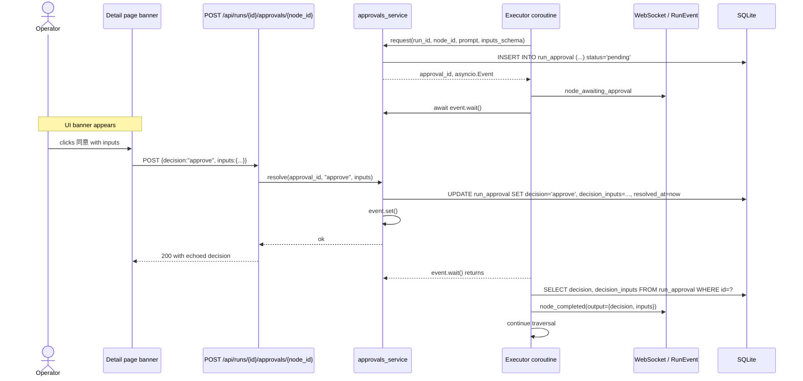

## Context

The platform's executor is a straight-line async walker. Every node call is `await action(params)`; the only suspension points are the action's own awaits (network, sleep, Playwright). A "pause until a human clicks a button" step is unusual for our system because it is the first node primitive whose duration is bounded only by external action — every other action terminates on its own.

Two parts of the platform already help. The `Run` row is durable, so a pending approval can survive a brief socket drop. The `RunEvent` stream is the single source of truth for the UI, so emitting an `node_awaiting_approval` event is enough for both the live socket and the history-page replay to render the pending state.

What is missing is the suspension primitive (an `asyncio.Event` per pending approval) and the resume entry-point (a small REST endpoint that resolves the decision and fires the event).

## Goals / Non-Goals

**Goals**

- One node primitive that pauses a run mid-flow and waits for a human decision.
- The decision (approve / reject) and any collected inputs are persisted as the node's `output`, available to downstream nodes via the standard `{{nodes...}}` token form.
- A rejection terminates the run with a distinct terminal status (`rejected`) so the run-history UI can show it differently from a `failed` run.
- The UI surfaces the pending approval prominently on the workflow detail page AND in the run-history list.
- The notification hook is a no-op in this change but is wired in the executor so the future notifications change is a pure body replacement.

**Non-Goals**

- Multi-approver flows ("any 2 of these 3 reviewers"). The current change has exactly one decision per approval node.
- Approval timeouts ("auto-reject after 30 minutes"). The current change blocks indefinitely; the run can be aborted via the existing 停止 button if the operator changes their mind.
- Per-approver ACLs. Single-user POC; the `resolved_by` column is reserved for future use but is not populated in this change.
- Comments / attachments / out-of-band evidence ("approver added a screenshot"). Just decision + inputs.
- Releasing the Chromium queue slot during the wait. Tradeoff resolved in Decision 4 in favour of keeping the slot; future change can opt out per-node.
- Resuming a run after the backend was restarted with an approval pending. The `asyncio.Event` is in-process; on restart we explicitly mark stale `RunApproval` rows as `lost` and transition the parent `Run` to `failed` with a clear message.
- Cross-page notifications inside the SPA (toast "approval requested in another workflow"). Out of scope; the operator sees the banner when they navigate to that workflow's detail page or to the runs list.

## Decisions

### Decision 1: New node type `approval`, no separate "wait" primitive

We considered making approval a generic "wait for external signal" node with a flexible payload. Rejected: 95% of real uses are approval flows, and making the primitive narrow makes the UI obvious. A future "wait for arbitrary external signal" can subclass the same `asyncio.Event` plumbing without changing the approval semantics.

Node params:

```python
class ApprovalInputSpec(BaseModel):
    name: str
    type: Literal["string", "number", "boolean"]
    default: Optional[Any] = None
    required: bool = False
    label: Optional[str] = None  # display label; falls back to `name`

class ApprovalParams(BaseModel):
    prompt: str
    inputs: list[ApprovalInputSpec] = Field(default_factory=list)
    approve_label: str = "同意"  # button label override
    reject_label: str = "拒绝"
```

The pydantic discriminator on `Node` already keys off `type`, so adding `"approval"` is a one-line literal extension plus a per-type `params` validator hook (the executor already validates `params` opportunistically; we centralise it here for the approval case so the chat editor's `update_node` patch fails fast on malformed shapes).

### Decision 2: Persist the approval as a row; suspend on an `asyncio.Event`

Two design choices for the suspension primitive:

- **asyncio.Event keyed by `(run_id, node_id)`** in a process-wide registry. **Chosen.** Fastest resume (microseconds), zero polling, no DB churn.
- **DB polling** (the executor's coroutine wakes every 500 ms and queries the `run_approval` row). Rejected: 500 ms latency, wasted DB queries, harder to reason about.

The asyncio.Event approach makes the executor implementation small:

```python
# inside run_workflow loop
if node.type == "approval":
    approval = approvals_service.request(
        run_id=run.id, node_id=node.id, prompt=node.params["prompt"],
        inputs_schema=node.params.get("inputs", []),
    )
    emit("node_awaiting_approval", node_id=node.id,
         prompt=approval.prompt, inputs_schema=approval.inputs_schema)
    notifications.emit("approval_requested", {...})  # no-op stub in this change
    resolved = await approvals_service.wait(approval.id)  # asyncio.Event under the hood
    if resolved.decision == "approve":
        context[node.id] = {"decision": "approve", "inputs": resolved.inputs}
        emit("node_completed", node_id=node.id, output=context[node.id], attempt=1)
        # continue traversal as normal
    else:
        emit("node_rejected", node_id=node.id, output={"decision":"reject", "inputs":resolved.inputs})
        emit("run_rejected", ...)
        # terminate the run with status="rejected"
```

The `approvals_service` is a singleton (one per process) that maps `approval_id → asyncio.Event` and holds the resolved `RunApproval` row alongside.



### Decision 3: Add `rejected` to the `Run.status` literal

A rejected run is structurally different from a failed run: nothing crashed, the operator deliberately stopped it. We add the literal `rejected` to `Run.status` (today's literal is `queued | running | completed | failed | aborted`) and emit a `run_rejected` terminal event. The run-history UI shows it with a distinct pill (neutral / amber, not red).

Rejection cascade: when a run is rejected at node `n_k`, every node after `n_k` is skipped. There is no "best-effort continue past rejection" — rejection is a terminal decision, not a routing decision. (If a future workflow author wants "if rejected, take this branch", they can compose it with `node-error-handling`'s `on_error="branch"` semantics by making the approval node raise on rejection instead, but that is NOT the v1 default.)

### Decision 4: Keep the queue slot during approval wait

Two options:

- **Hold the slot** (chosen). The Chromium tab stays open on whatever page it landed on; the run keeps `Run.status="running"`; the queue does not advance. Simple, intuitive ("my workflow is paused, of course it's still my turn"). Risk: an approval that takes hours starves the queue.
- **Release the slot, re-queue on approval**. The Chromium tab closes; the run row goes back to `status="queued_awaiting_approval"`; when the human approves, the run is re-promoted FIFO. Complex, but it lets other workflows progress while a human is asleep. Forces the workflow to be idempotent / re-entrant on its prior state, which our headed Chromium model does not support (the tab's cookies, scroll position, and Playwright state are lost on close).

Chosen: **hold the slot** for v1. The single-user POC's workflows are short and the operator is rarely asleep mid-run. Future change can add a per-approval `release_slot: bool` field that closes the tab and re-queues; we explicitly leave a hook in the queue scheduler (`scheduler.can_run_held(slot)`) for it.

### Decision 5: Pending approval is a derived field on `Run`, not a stored status

`Run.status` stays `"running"` throughout the wait. The UI's "等待审批" pill is computed from the presence of an unresolved `RunApproval` row, returned on `GET /api/runs/{id}` and `GET /api/runs` as `pending_approval: {node_id, prompt, inputs_schema} | null`. Rationale:

- Avoids a six-status state machine (every transition would need explicit handling in `services.runs.transition_run`).
- The `Run.status` column is a small literal set; adding `awaiting_approval` would shadow the `running` semantics ("is it still using its queue slot? yes; is it actively executing actions? no").
- The derived field is cheap (one `SELECT … LIMIT 1` per `Run` row in the list endpoint; an `IN`-batched query for the runs-list endpoint).

### Decision 6: REST resolve endpoint, NOT a WebSocket frame

We resolve the approval through `POST /api/runs/{id}/approvals/{node_id}`. We considered extending `/ws/run` with a `{type:"approve"}` client frame. Rejected:

- Approvals can be resolved from a different browser tab than the one holding the run socket (operator opens the workflow detail page on a tablet to approve a run started from their desktop).
- The REST endpoint composes cleanly with future programmatic clients (a Slack bot button calling `POST /api/runs/.../approvals/...`).
- Idempotency: a POST with the same body twice is rejected with 409 by the row's status check; a duplicate WS frame is harder to handle.

The socket still receives the resulting `node_completed` / `node_rejected` event in real time, so the originating tab updates seamlessly.

### Decision 7: Restart resilience — pending approvals on backend restart become `lost`

The `asyncio.Event` lives in process memory. A backend restart erases every pending event. The next `lifespan` startup hook SHALL find every `RunApproval` row with `decision IS NULL` AND its parent `Run.status = "running"`, mark each row's `decision = "lost"`, and transition the parent run to `status = "failed"` with `Run.finished_at = now()` and an emitted `run_failed` event whose payload reads `"approval lost across backend restart"`. This is a single lifespan helper (`reap_lost_approvals_on_startup()`) that runs after `init_db()` and before the scheduler builds.

Alternatives considered: rebuild `asyncio.Event`s on restart (impossible — the executor coroutine that was awaiting is also gone); auto-resume the run from the approval node (impossible without restoring the Chromium tab state; the headed singleton was killed too). Killing the run is the only honest option.

### Decision 8: Inputs are validated against the schema before resolving

When the operator posts an approve decision with `inputs: {...}`, the endpoint validates the inputs against the approval's `inputs_schema` (required fields present, types match per the spec literal). Validation failure returns HTTP 422 with the field-level error; the approval stays pending. Rejection does NOT validate the inputs (a rejected run carries `inputs: {}` regardless, by convention).

### Decision 9: Notifications hook signature is locked now even though the body is a stub

```python
# backend/app/services/notifications.py
async def emit(event_name: str, payload: dict) -> None:
    """Fire an event for downstream subscribers (email, Slack, webhook, …).
    No-op stub in this change; the future notifications change replaces the body."""
    log.info("notifications.emit %s %s", event_name, payload)
```

Locking the signature lets the future notifications change be additive (a config table, a few subscriber implementations) without touching the executor. We document the event name (`"approval_requested"`) and payload shape (`{run_id, workflow_id, node_id, prompt}`) as part of the spec so subscribers can rely on it.

## Risks / Trade-offs

- **Indefinite blocking** of the queue. Single-user POC; mitigation is the 停止 button (existing abort plumbing kills the executor task, which cancels the `await event.wait()`, which terminates the run with `status="aborted"`).
- **Pending approval lost on restart** terminates the run as `failed`. Documented; the operator must restart the workflow. Future: persist enough state to resume from before the approval (requires Playwright state snapshotting; outside scope).
- **No multi-approver in v1**. If the operator builds a workflow that should require two sign-offs, they must chain two approval nodes. Documented; future change can add `n_of_m` semantics.
- **No timeout in v1**. If an approval sits pending for days, the run row stays `"running"` (and the queue is blocked) until the operator either approves, rejects, or hits 停止. Documented loudly in the UI: the pending-approval banner shows the elapsed time and reminds the operator that the queue is held.
- **Approval resolved from a stale UI** (the operator's tab was opened hours ago and the run has since been aborted). The endpoint returns HTTP 410 with `{"detail": "run is no longer pending approval (status=...)"}`; the UI handles by refreshing the page state.

## Migration Plan

- New `run_approval` table created by `SQLModel.metadata.create_all(engine)` on first boot.
- `Run.status` literal extension is purely application-level (no DB column change; the column is text).
- Workflow-schema extension (`NodeType` += `"approval"`) is purely application-level. Pydantic deserialises old workflow JSON identically; no workflow can contain `"approval"` until the operator (or the editor agent) adds one.
- `lifespan` reaps lost approvals on first boot AFTER `init_db()`. The first reap on the new database is a no-op.

## Resolved Decisions

The two original open questions were closed by the user before implementation:

1. **Queue slot during approval wait** → **HOLD** (per Decision 4 above). The Chromium tab stays open, `Run.status="running"`, and no other run for the same workflow advances until the approval is resolved or the run is aborted. Rationale: minimum viable; the release-and-re-queue alternative adds significant lifecycle complexity (Playwright state snapshot/restore, re-entry semantics) for marginal benefit at single-user scale.
2. **Approval timeout** → **NO timeout in v1**. A future change "approval-timeouts" will introduce a soft "remind after N minutes" by wiring the existing `services.notifications.emit("approval_requested", ...)` hook to a delayed APScheduler task (which requires `triggers-and-scheduling` to be in place for the scheduler). Documented in proposal/Out-of-scope and in the spec's Out-of-scope.

## Open Questions

All design decisions resolved as of 2026-05-15.
