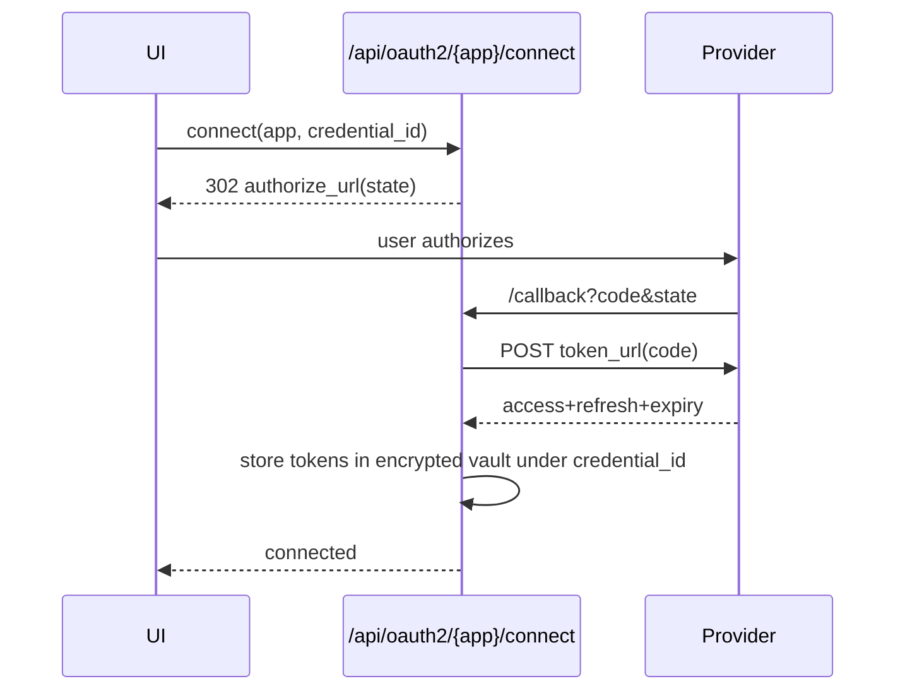

## Context

`expanded-node-library` gives us a raw `http_request` node and the `app/nodes/` module pattern. `per-workflow-credentials` gives an encrypted vault and `{{cred...}}` interpolation. To get n8n-style app integrations without writing a node per app, we make an app a **descriptor** (data) executed by a **generic core**, with **typed credentials** that inject auth. This change is the framework; `core-app-integrations` ships the first apps on top of it.

## Goals / Non-Goals

**Goals**
- An app = `{credentials, resources[{operations[{fields, request, response}]}]}` data descriptor.
- A single `integration` node executes any operation by rendering its declarative request and mapping the response to items.
- Typed credentials with `api_key`/`bearer`/`basic`/`oauth2` injection; OAuth2 connect + refresh.
- A descriptor-driven UI so new apps need no frontend code.
- Reuse the `http_request` transport (retry/timeout/redirect/error mapping).

**Non-Goals**
- Shipping specific apps (`core-app-integrations`).
- A visual descriptor builder.
- App triggers/webhooks (`polling-and-app-triggers`).
- GraphQL/SOAP (REST/JSON first).

## Decisions

### Decision 1: Descriptor schema

```python
# app/integrations/schema.py
class Field(BaseModel):
    name: str; label: str
    kind: Literal["string","number","boolean","options","collection","json"]
    required: bool = False
    options: list[Opt] | None = None
    default: Any = None

class RequestTemplate(BaseModel):
    method: Literal["GET","POST","PUT","PATCH","DELETE"]
    url: str                       # template, may reference {{$fields.x}} / {{$cred.y}}
    query: dict[str, str] = {}
    headers: dict[str, str] = {}
    body: dict | str | None = None # template; json by default
    body_type: Literal["json","form","raw"] = "json"

class ResponseMap(BaseModel):
    item_path: str | None = None   # JSONPath-lite to the array of records
    root_path: str | None = None   # when the result is a single object
    pagination: Pagination | None = None

class Operation(BaseModel):
    name: str; label: str
    fields: list[Field]
    request: RequestTemplate
    response: ResponseMap

class Resource(BaseModel):
    name: str; label: str; operations: list[Operation]

class IntegrationDescriptor(BaseModel):
    app: str; version: str
    credentials: list[str]         # credential-type names this app uses
    resources: list[Resource]
```

Descriptors live under `app/integrations/<app>/descriptor.(py|json)` and are loaded + validated at startup into a `registry: dict[app, IntegrationDescriptor]`.

### Decision 2: Generic execution pipeline

The `integration` node params are `{app, resource, operation, fields: dict}`. Execution:
1. Look up the descriptor + operation in the registry; validate `fields` against the operation's `Field[]` (required/kind/options).
2. Build a render namespace: `$fields` (the node's field values, each first run through `node-context-variables`/`expression-engine`), `$cred` (the resolved typed credential), plus the standard `nodes`/`item`/`items`.
3. Render `RequestTemplate` (method, url, query, headers, body) against that namespace.
4. Inject auth per the credential type's strategy (Decision 4) — adds headers/query/body without the descriptor having to know secrets.
5. Execute via the shared `http_client` (Decision 3): timeout, retry, redirect policy, error→message mapping.
6. Map the response to `items` per `ResponseMap`: when `item_path` resolves to an array, emit one item per element; when `root_path`, emit a single item; binary responses become an item with `binary`.
7. Pagination: if `response.pagination` is set, loop (cursor/offset/link-header) accumulating items up to `max_pages`/`max_items_per_node`.

### Decision 3: Extract a shared `http_client` from `http_request`

`http_request` (from `expanded-node-library`) already encodes retry/backoff, timeout, redirect, SSRF guard, and error mapping. We factor that into `app/nodes/_http_client.py` and have BOTH `http_request` and the integration executor call it. No behaviour change to `http_request`; it becomes a thin wrapper.

### Decision 4: Typed credentials + auth injection

```python
class CredentialType(BaseModel):
    type: str                      # "slack_oauth2", "generic_api_key", ...
    fields: list[Field]            # secret fields flagged kind="secret"
    auth: AuthSpec

class AuthSpec(BaseModel):
    strategy: Literal["api_key_header","api_key_query","bearer","basic","oauth2","none"]
    # api_key_*: header_name/query_name + which field holds the key
    # bearer: which field holds the token
    # basic: which fields are user/pass
    # oauth2: authorize_url, token_url, scopes, client_id field, client_secret field
```

The vault stores credential *instances* (encrypted field values) tagged with a `type`. At request time the framework reads the instance, decrypts via the existing vault, and injects per `strategy`. For `oauth2`, the stored instance also holds `access_token`/`refresh_token`/`expires_at` (in the encrypted vault); the injector refreshes when expired before the call. Existing untyped credentials map to a `generic` type (no auto-injection; referenced only via `{{cred...}}` in templates), so nothing breaks.

### Decision 5: OAuth2 connect flow



Refresh is lazy: before injecting a bearer token, if `expires_at` is within a skew window, the injector calls `token_url` with the refresh token and updates the vault. State is signed to prevent CSRF; the callback validates it.

### Decision 6: Descriptor-driven UI

The NodeInspector fetches the registry catalogue (`GET /api/integrations`) and the selected app's descriptor (`GET /api/integrations/{app}`), then renders: resource `<select>` → operation `<select>` → a field form generated from `Field[]` (each `kind` maps to a control). No per-app frontend code. Credential forms are generated the same way from the `CredentialType.fields`.

### Decision 7: Secret redaction in events

The request renderer tags which header/query/body values came from secret fields or auth injection; the `node_completed`/debug events redact them as `"***"`. Descriptors never embed secrets; they reference credential fields by name.

## Risks / Trade-offs

- **Descriptor expressiveness vs simplicity**: some APIs need request signing, multipart, or odd pagination. v1 covers REST/JSON + cursor/offset/link pagination + the five auth strategies; exotic cases get a thin custom executor hook (`app/integrations/<app>/custom.py`) the descriptor can opt into. Documented escape hatch.
- **OAuth2 complexity**: refresh races, provider quirks. Mitigation: lazy refresh with a per-credential lock; recorded-fixture tests for the connect + refresh paths.
- **SSRF / secret leakage**: the shared `http_client` keeps the SSRF guard; the redactor prevents secret logging. Tested.
- **Registry as code vs DB**: descriptors are code/data files (versioned in git), not user-editable in v1. Trade-off: adding an app is a deploy, not a UI action. Acceptable; a user-authored descriptor store is a later change.

## Migration Plan

- DB migration: add `type` column to credentials (default `generic`); new `oauth_tokens`/credential-token storage (or reuse the vault with reserved field names).
- Additive `integration` node type.
- Land after `expanded-node-library` (for `http_request`/`http_client`). `core-app-integrations` follows.

## Open Questions

- Store OAuth tokens as reserved vault fields on the credential instance vs a dedicated table? Leaning reserved vault fields to reuse encryption; revisit if multi-token-per-credential is needed.
