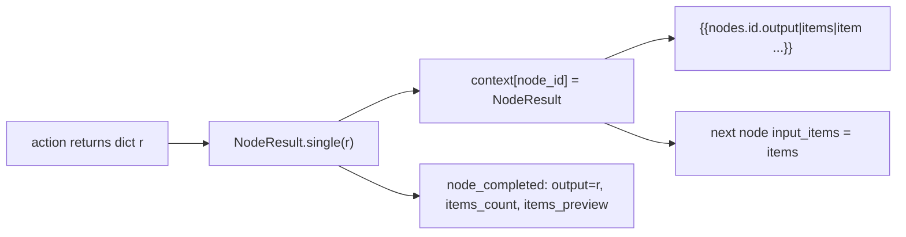

## Context

The executor (`backend/app/executor.py`) runs nodes one at a time; each action in `app/tools/actions.py` returns a `dict`, which the executor emits as `node_completed.output` and (after `node-context-variables`) stores in a per-run `context: dict[node_id, dict]`. There is no concept of "a list of records flowing through the graph". n8n's model — every node emits `Item[] = {json, binary}[]` — is the prerequisite for Merge, Set, Item Lists, Aggregate, and for carrying downloaded files as binary.

This change adds the envelope while preserving 100% of today's behaviour for the nine existing node types.

## Goals / Non-Goals

**Goals**
- Introduce `NodeResult { output, items }` and `Item { json, binary }` as the canonical node result.
- Keep `output` working exactly as today (it is `items[0].json` for single-item nodes).
- Thread predecessor items into each node as `input_items` for linear chains.
- Give binary payloads a typed home that integrates with the artifact store when present.
- Keep `{{nodes.<id>.output...}}` unchanged; add `items` / `item` token roots.

**Non-Goals**
- Fan-in concatenation across multiple predecessors (that is `dag-executor-merge`).
- Per-item parallelism for browser actions (single Chromium tab stays sequential).
- A streaming/iterator item model (items are materialised, capped).
- New data-transform nodes (that is `data-transform-nodes`); this change only defines the shape they will use.

## Decisions

### Decision 1: `output` is the back-compat alias, `items` is the source of truth

```python
# backend/app/nodes/result.py
@dataclass
class BinaryRef:
    kind: Literal["inline", "artifact"]
    mime: str
    size: int
    filename: str | None = None
    data_b64: str | None = None      # set when kind == "inline"
    artifact_id: str | None = None   # set when kind == "artifact"

@dataclass
class Item:
    json: dict[str, Any]
    binary: dict[str, BinaryRef] = field(default_factory=dict)

@dataclass
class NodeResult:
    output: dict[str, Any]           # legacy primary dict; == items[0].json for single-item
    items: list[Item]

    @classmethod
    def single(cls, output: dict[str, Any], binary: dict[str, BinaryRef] | None = None) -> "NodeResult":
        return cls(output=output, items=[Item(json=output, binary=binary or {})])
```

The executor wraps every legacy action return `r` via `NodeResult.single(r)`. For a node that returns `None` (e.g. `start`/`end`/`wait`), the result is `NodeResult.single({})` so `output` is always a dict and the context entry is uniform. When a future data node produces multiple items, `output` is set to `items[0].json` (or `{}` when the array is empty) so any code or token still reading `output` gets a defined value.

### Decision 2: Executor threads `input_items`, single-predecessor only here

The executor computes the current node's `input_items` as the predecessor's `NodeResult.items` (the node whose edge we just followed). For `start` (no predecessor) `input_items = [Item(json={}, binary={})]` — a single empty item, matching n8n's "one empty item triggers the chain". Multi-predecessor fan-in is explicitly deferred: if a node has more than one resolved predecessor in this change's linear walk it still only ever arrives via one edge, so the single-predecessor rule is total here. `dag-executor-merge` generalises this to concatenation.

`_run_node` gains an optional keyword `input_items: list[Item]`. Existing actions ignore it (they operate on the shared browser page or take explicit params); the parameter exists so `data-transform-nodes` can consume it without another executor change.

### Decision 3: Binary lives outside the JSON, referenced by name

A node attaches binary under string keys (n8n calls the default key `data`): `item.binary = {"data": BinaryRef(...)}`. Rules:
- `kind="inline"` when `size <= INLINE_BINARY_MAX` (default 256 KB): the bytes are base64 in `data_b64`.
- `kind="artifact"` when larger AND `run-artifacts-observability` is active: bytes are stored as a `download`/`print` artifact and referenced by `artifact_id`.
- When the payload is large but the artifact store is absent, bytes spill to a sandboxed temp file under `backend/data/workflow_files/_binary/` and are referenced as an `artifact` with a file-path id (forward-compatible — the artifact change adopts these).
- Binary is **never** interpolated into a string param. A `{{nodes.<id>.item.binary.data}}` token raises `VariableResolutionError("binary values cannot be interpolated into text; use a file node to consume binary")`.

### Decision 4: Token roots — `output` (unchanged), `items`, `item`

Extends `node-context-variables` resolution against `context[node_id]: NodeResult`:

```text
{{nodes.n1.output.product_id}}     # NodeResult.output["product_id"]  (UNCHANGED)
{{nodes.n1.items}}                 # whole list[Item] as JSON (json+binary-summary per item)
{{nodes.n1.item.json.product_id}}  # sugar for items[0].json["product_id"]
{{nodes.n1.item.json}}             # items[0].json
```

`item` always means the **first** item (index 0); per-item iteration variables (`{{item.json...}}` bound inside a `foreach`/`splitInBatches` body) are a loop-scope concern owned by the loop nodes, not this change. When `items` is interpolated into a larger string it is `json.dumps`'d with binary summarised as `{name: {mime, size}}` (never the bytes).

### Decision 5: Event payload stays small

`node_completed` keeps `output` verbatim and adds:
- `items_count: int`
- `items_preview: dict` — the first item's `json`, plus `binary` summarised as `{name: {mime, size, filename}}`.

The full array is never serialised into the event (a 1000-item Set output would bloat the run log and DB). The UI shows count + preview; the artifact store (when present) holds binary. This keeps `RunEvent.payload_json` bounded.

### Decision 6: Backward compatibility is total

- Every existing action returns a dict → wrapped to a single-item envelope → `output` identical to today.
- `{{nodes.<id>.output...}}` resolves against `NodeResult.output` → identical behaviour.
- The seeded `示例工作流` and the Apple workflows run unchanged.
- No DB migration: the envelope is in-memory; the event gains two additive fields that old replay code ignores.



## Risks / Trade-offs

- **Memory for large item arrays**: a Set/Item-Lists node over a big list materialises all items. Mitigation: a per-run item cap (default 10000) raises a `node_failed` with a clear message; streaming is out of scope.
- **Inline binary bloat**: capped at 256 KB inline; larger spills to artifact/temp. The cap is configurable via settings.
- **Token ambiguity (`output` vs `item.json`)**: for single-item nodes they are identical; we document `output` as the canonical authored form and `item.json` as sugar, so the editor LLM keeps emitting `output`.
- **Partial fan-in**: defining only single-predecessor threading here risks a half-feature. Mitigation: the executor asserts a single resolved predecessor on the linear path and `dag-executor-merge` is the named follow-up; no user-facing fan-in is promised by this change.

## Migration Plan

- No DB migration. Additive event fields.
- Ship behind no flag — wrapping is transparent. Land `node-context-variables` first (hard dependency for the context dict).
- Frontend reads `items_count`/`items_preview` if present, falls back to `output` otherwise.

## Open Questions

- Should `INLINE_BINARY_MAX` and the per-run item cap be per-workflow overridable? Default: global settings only in v1; revisit if users hit the cap.
