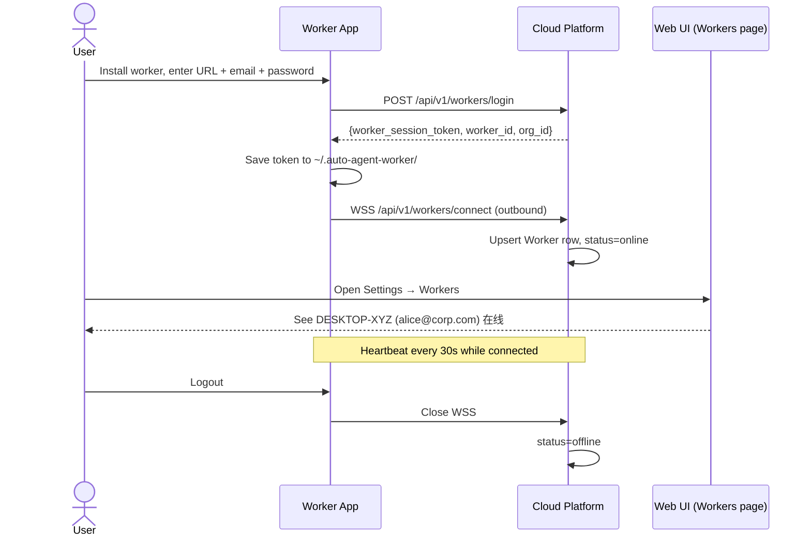
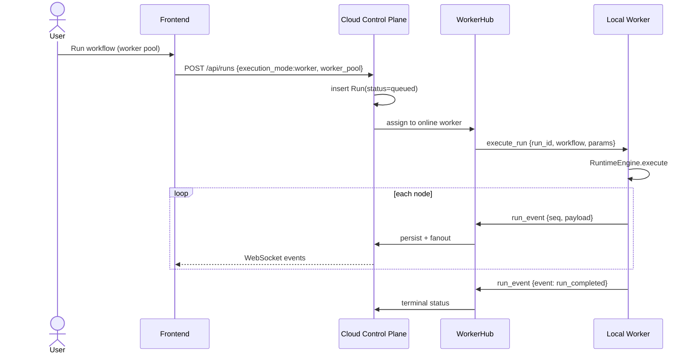

## Context

`auto_agent` today runs workflow execution inside the FastAPI process: `_ensure_dispatcher` admits runs and spawns `_drive_run`, which calls `begin_run` (Playwright), `run_workflow` (executor), persists `RunEvent` rows, and fans out over WebSocket. Browser sessions are validated with `is_active_in_process` — they cannot cross process boundaries.

The product roadmap shipped browser sessions, concurrent context pools, remote CDP providers, public API, and livestream — all assuming the browser lives on the **same machine as the API**. Cloud deployment was explicitly out of scope for the platform MVP.

The user requirement (option C) is **cloud orchestration + edge execution**: workflows must run on a user's desktop or intranet host where VPN, SSO cookies, and headed browsers exist, while the web UI, triggers, run history, and LLM keys remain centralized.

Prior art: Power Automate Desktop (cloud flow + PAD runtime), UiPath Robot (Orchestrator + unattended/attended robot), GitHub Actions self-hosted runner (outbound agent connection), Skyvern cloud + optional local browser (we align closer to PAD than Skyvern cloud-only).

## Goals / Non-Goals

**Goals:**

- Support `execution_mode=worker` runs assigned to registered local agents without changing the existing event protocol or replay UX.
- Worker connects **outbound** to cloud (no inbound firewall holes on the edge).
- Reuse the existing executor, browser pool, profiles, approvals, and artifact pipeline on the worker with minimal duplication.
- Keep `execution_mode=cloud` as the default so local dev and headless cloud deployments behave as today.
- Centralize LLM API keys on cloud via an authenticated proxy for worker runs.
- Relay livestream frames so the web UI live view works for worker runs.
- **Login-first worker UX**: user installs the worker app, logs in with platform credentials, worker connects outbound automatically, and the org sees the machine online in the cloud Workers UI.
- **Environment preflight**: worker verifies Playwright/Chromium, cloud reachability, and headed display before connecting; cloud shows readiness and skips not-ready workers for dispatch.

**Non-Goals:**

- Win32 / macOS UIA desktop automation (future change; worker package is the extension point).
- Worker MSI/dmg installer, auto-update, or system tray UI (v1: CLI + systemd/launchd docs).
- Offline execution when cloud is unreachable (worker rejects new jobs; in-flight run fails clearly).
- Cross-machine browser profile sync or shared credential vault across workers.
- Distributed scheduler across multiple cloud regions.
- Replacing cloud-mode execution entirely — both modes coexist.

## Decisions

### Decision 1: Outbound WebSocket as the worker control channel

The worker opens `WSS /api/v1/workers/connect` and keeps a long-lived session. Cloud pushes `{type:"execute_run", ...}` and `{type:"abort", ...}`; worker pushes `{type:"run_event", ...}`, `{type:"stream_frame", ...}`, and heartbeats.

- **Why**: enterprise firewalls block inbound connections to desktops; outbound HTTPS/WSS is standard (same as GitHub Actions, Tailscale, etc.).
- **Alternative rejected**: worker polls `GET /jobs` — higher latency, harder push abort, more load.
- **Alternative rejected**: cloud opens RPC to worker — requires VPN or public IP on every desktop.

### Decision 2: User login on worker, then outbound connect (primary path)

The worker app presents a **login screen** (cloud URL + email + password — same identity as the web UI via `multi-user-orgs`). On success the cloud returns a **worker session token** (`wk_sess_…`) scoped to that user + org. The worker persists it locally (`~/.auto-agent-worker/credentials`), opens `WSS /api/v1/workers/connect`, and the platform **immediately lists the machine** under Settings → Workers (hostname, user email, online/offline, tags, active runs).

- **Why**: matches user expectation from Power Automate Desktop / GitHub CLI — install, sign in, appear in cloud. No admin pre-provisioning step for normal users.
- **Reconnect**: saved session reconnects silently; expired/revoked session prompts re-login.
- **Logout**: worker closes WebSocket, clears local credentials, cloud marks offline.

**Secondary path — enrollment tokens (`wk_enroll_…`)**: org admins can still mint one-time tokens for headless/service installs (CI room server, unattended VM). Not the default UX.

- **Alternative rejected**: admin-only enrollment tokens as the only path — too much friction; users cannot self-serve.
- **Alternative rejected**: reuse `sk_` API keys for worker login — full API access on every laptop; wrong scope.

### Decision 3: Cloud orchestrates; worker executes — no split executor rewrite

Extract the body of `_drive_run` (from `begin_run` through `run_workflow` and terminal cleanup) into `RuntimeEngine.execute(run_spec, emit_fn)`. Cloud keeps enqueue, persistence, fanout, webhooks; worker calls the same engine locally.

- **Why**: minimizes drift between cloud and worker execution semantics; tests against one engine.
- **Alternative rejected**: duplicate executor in worker package — guaranteed divergence.

### Decision 4: Event shape unchanged; cloud validates `seq`

Worker sends the same payloads the in-process executor emits today. Cloud ingests via the worker WebSocket, validates `run_id` + monotonic `seq`, calls existing `_persist_event` + `_fanout`.

- **Why**: frontend replay, webhooks, and cost tracking stay untouched.
- **Alternative rejected**: new protobuf event stream — unnecessary migration cost.

### Decision 5: Per-worker concurrency; cloud pool applies only to `execution_mode=cloud`

Worker advertises `max_concurrent_runs` (default 1 for laptops). Cloud tracks `active_runs` per worker and only assigns when capacity exists. Cloud `max_concurrent_browser_runs` applies only to in-process cloud runs.

- **Why**: a desktop cannot safely run 3 headed Chromium instances by default; cloud and edge capacities are independent.
- **Alternative rejected**: global cloud slot for worker runs — would block cloud runs incorrectly.

### Decision 6: Worker pool selection via tags

`Run.worker_pool` (string, default `"default"`) matches workers with that tag. Explicit `Run.worker_id` pins to one machine. If no worker online, run stays `queued` with a clear queue reason.

- **Why**: simple routing without a full scheduler product; mirrors GitHub runner labels.
- **Alternative rejected**: automatic geo routing — no data in v1.

### Decision 7: Secrets and profiles stay on the worker

Worker-mode runs resolve `browser_profile_id` and `{{cred.*}}` against the worker's local SQLite + Fernet vault. Cloud stores profile **names/ids** for UI consistency but does not require profile bytes on cloud.

- **Why**: intranet credentials must not transit through cloud; matches PAD model.
- **Trade-off**: profile ids must exist on the worker (created locally or synced manually in v1).
- **Alternative rejected**: cloud sends decrypted credentials to worker — unacceptable for enterprise.

### Decision 8: Cloud LLM proxy for agent steps on worker runs

Worker calls `POST /api/v1/internal/llm/complete` (worker-auth only) with `{purpose, messages, image_artifact_id?}`. Cloud runs `get_adk_model_cached()` and returns text/structured output.

- **Why**: API keys stay in cloud `.env`; operators rotate keys once.
- **Alternative rejected**: copy LLM keys to every worker — operational nightmare.

Implementation note: monkeypatch or inject an LLM client factory in the worker process that routes agent modules to the proxy.

### Decision 9: Livestream relay through existing hub

Worker uploads `{type:"stream_frame", run_id, seq, jpeg_base64, width, height}`. Cloud `livestream.ingest_frame(run_id, frame)` feeds the same viewer hub as in-process CDP screencast.

- **Why**: zero frontend changes for live view.
- **Alternative rejected**: viewers connect directly to worker — firewall blocker.

### Decision 10: Optional `EXECUTION_BACKEND=control_plane_only` deploy mode

Cloud container sets this env var to skip Playwright lifespan initialization entirely when no cloud-mode runs are expected.

- **Why**: smaller cloud image, no Chromium deps on control plane.
- **Default**: unset / `full` — current behavior for local dev.

### Decision 11: Environment preflight before connect (`doctor`)

Before login/connect, the worker runs `preflight()`:

1. **Critical (block connect)**: Playwright import, Chromium binary, headless smoke launch, cloud `/health` reachable.
2. **Warning (degraded)**: headed display missing when `BROWSER_HEADLESS=false`, low disk/RAM.

Results are shown locally (`auto-agent-worker doctor`) and reported to cloud in connect + heartbeat as `environment_status: ready | degraded | not_ready`. The dispatcher assigns jobs only to `ready` workers, or `degraded` when the run does not need failing capabilities (e.g. no headed runs when display missing).

- **Why**: avoids "worker online but every run fails" — common when Chromium not installed or Linux server has no DISPLAY.
- **Alternative rejected**: check only at job time — user sees green worker in cloud UI but runs fail silently.
- **Alternative rejected**: cloud-side check — cloud cannot inspect local Chromium install.

```text
auto-agent-worker start
  → preflight()           # local, before WSS
  → login (if needed)
  → WSS connect + env payload
  → heartbeat includes env summary
```

## Architecture

```text
┌──────────────── Cloud Control Plane ────────────────────────────────┐
│  FastAPI  •  SQLite/Postgres  •  Web UI  •  Triggers  •  LLM keys │
│                                                                     │
│  enqueue_run ──▶ dispatcher ──┬── cloud mode ──▶ _drive_run (local) │
│                               └── worker mode ──▶ assign + push job │
│                                                                     │
│  WorkerHub (WS) ◀──────────────────────────────────────┐              │
│  event ingest ──▶ _persist_event / _fanout           │              │
│  stream ingest ──▶ livestream hub                    │              │
└──────────────────────────────────────────────────────│──────────────┘
                                                       │ WSS outbound
┌──────────────── Edge Worker Agent ───────────────────▼──────────────┐
│  1. User logs in (cloud URL + email + password)                     │
│  2. Worker opens WSS /api/v1/workers/connect (outbound)             │
│  3. Cloud Workers UI shows machine online                           │
│  RuntimeEngine.execute  •  browser_pool  •  local profiles/creds  │
│  Playwright Chromium  •  CDP screencast upload                      │
└─────────────────────────────────────────────────────────────────────┘
```

### Worker login and visibility lifecycle



### Worker job lifecycle



## Risks / Trade-offs

- [Worker offline while run queued] → Run stays `queued` with `queue_reason=waiting_for_worker`; UI shows clear message; optional timeout policy later.
- [Worker dies mid-run] → Cloud marks run `failed` after heartbeat timeout; no automatic retry on another worker in v1 (operator re-runs).
- [Profile id mismatch across machines] → Document that worker profiles are local; UI warns when selected profile may not exist on target pool.
- [LLM proxy latency] → Acceptable for agent steps; cache/deterministic nodes unaffected; worker batches nothing in v1.
- [Duplicate seq from buggy worker] → Cloud rejects out-of-order events with logged error; run fails safely.
- [Large stream frames over WS] → Same JPEG quality caps as today; latest-wins backpressure on cloud hub.
- [Security of worker token theft] → Revocation in Settings (per worker or per user logout-all); tokens bound to user+org; TLS required for WSS; short TTL + refresh optional in v2.
- [Same user, multiple machines] → Each connect upserts by `(org_id, user_id, machine_id)`; all visible in Workers list.

## Migration Plan

1. **Additive schema**: `worker` table, `run.execution_mode`, `run.worker_id`, `run.worker_pool` columns with defaults preserving current behavior.
2. **Phase A**: Worker registration + heartbeat only (no execution) — validate connectivity.
3. **Phase B**: `RuntimeEngine` extraction + worker executes test workflow end-to-end.
4. **Phase C**: Event relay + frontend worker badge + run enqueue selector.
5. **Phase D**: Livestream relay + LLM proxy + approval/abort relay.
6. **Phase E**: `EXECUTION_BACKEND=control_plane_only` cloud deploy docs + Docker sample.

Rollback: disable worker assignment in UI; all runs use `execution_mode=cloud`. Worker process optional.

## Open Questions

- Worker desktop UI v1: minimal Electron/Tauri window vs CLI `login` subcommand + system tray? (Lean: CLI login + optional simple local web UI on `localhost:3921` for password form; tray later.)
- Session TTL for worker tokens: 30 days with refresh, or until explicit logout? (Lean: 30 days, re-login on expiry.)
- Artifact binary upload: worker streams artifacts to cloud during run, or only metadata in v1? (Lean: metadata + small inline artifacts in v1; large file upload endpoint in follow-up.)
- Pin `worker_id` on scheduled/cron triggers? (Lean: trigger gains optional `worker_pool`; defer per-trigger pin.)
