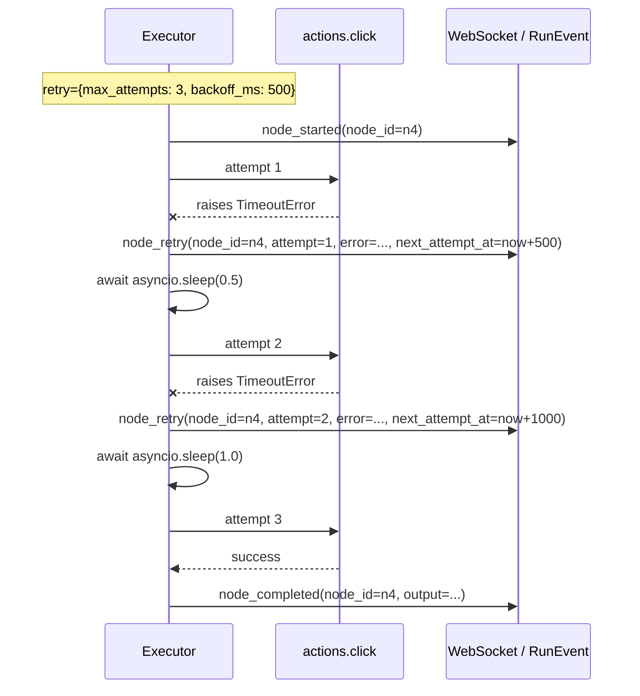
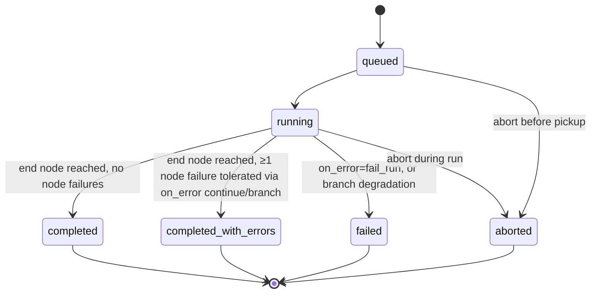

## Context

The executor today is a linear walker: for each node it awaits the action, emits `node_completed` or `node_failed`, and on failure stops traversal. There is no inner retry, no alternate path, no per-node policy. This is the right default for a POC but the wrong default for any non-trivial browser automation, where transient selector misses, network glitches, and rate limits are the norm.

The data we need is small (three optional fields), the executor changes are local (one retry loop, one edge-picking helper), and the UI changes are additive (one new section in the inspector, one new edge style on the canvas, one nested-row treatment in the run log).

This change does NOT add new node types and does NOT change action signatures. It composes with `node-context-variables` (so an on-error branch can read `{{nodes.<failed_id>.error.message}}` once both ship; without the variables change the error is still observable as an event, just not interpolable into downstream params).

## Goals / Non-Goals

**Goals**

- A node author declares "retry this up to N times with M ms between attempts" through a single, validated schema fragment.
- A node author declares "if this node finally fails after retries, what should happen?" through a single enum.
- The graph topology directly expresses try/catch via a new edge `kind`.
- Every retry is observable as its own event in the run log; replay reproduces the timeline faithfully (compressed; same rule as `wait` node — see Decisions).
- Default behaviour is unchanged for every workflow that does not opt in.

**Non-Goals**

- Exponential backoff (`backoff_ms * 2^i`). Linear is enough for v1 and is easier to reason about for the operator.
- Random jitter on backoff. Deterministic timing makes the replay match the live run.
- Circuit breakers ("disable this workflow after 5 consecutive failed runs"). A separate, future change that consumes the `Run.status` history.
- Cross-node retry budgets ("retry the whole sub-chain N times"). Per-node only; group-level retry is composable from `on_error="branch"` + a loop back via an `on_error` edge.
- Alerting on repeated failures. Belongs to the deferred notifications change.
- Time-based retry windows ("retry only during business hours"). Time-aware scheduling lives in `triggers-and-scheduling`; retries are a runtime concern, not a scheduling one.
- A `retry` field on the workflow level ("retry every node by default"). Forces the operator into per-node intent, which is what we want for opt-in fault tolerance.

## Decisions

### Decision 1: Three independent schema additions, validated at the `Workflow` model level

We add exactly three optional fields. They are independent:

```python
class RetryPolicy(BaseModel):
    max_attempts: int = Field(ge=1, le=10)
    backoff_ms: int = Field(ge=0, le=60_000)

class Node(BaseModel):
    # ... existing fields ...
    retry: Optional[RetryPolicy] = None
    on_error: Literal["fail_run", "continue", "branch"] = "fail_run"

class Edge(BaseModel):
    # ... existing fields ...
    kind: Literal["next", "on_error"] = "next"
```

The maxima (10 attempts, 60 s backoff) cap pathological configurations. The `RetryPolicy` object exists so future extensions (jitter, exponential, per-error-type rules) have a place to live without breaking the schema.

### Decision 2: Linear backoff, no jitter

`delay_before_attempt(i) = retry.backoff_ms * i` where `i ∈ [1, max_attempts-1]` (the first attempt has no delay; the second waits `backoff_ms`, the third waits `2*backoff_ms`, etc.). No randomness. The choice is pragmatic:

- Linear is one multiplication, easier for the operator to predict.
- Determinism makes replays match live runs (the replay still compresses delays per the existing rule — see Decision 6).
- The most common transient errors we expect (selector miss, slow page load) clear within 1–3 attempts at 500–1000 ms backoff; exponential is overkill.

If a future change needs exponential, it adds `retry.kind: "linear" | "exponential"` with `"linear"` as default.

### Decision 3: Retry counting includes the first attempt

`max_attempts = 3` means up to 3 invocations of the action: one initial + two retries. Rationale: matches `requests`-style retry semantics and is what an operator says out loud ("try at most three times"). The first attempt has no preceding delay.



### Decision 4: On-error policy resolves AFTER retries are exhausted; `continue` terminates as `completed_with_errors`

The retry loop runs first. Only when `max_attempts` are all exhausted (or `retry is None`) does the executor consult `on_error`:

- `"fail_run"` (default): emit `node_failed`, then `run_failed`. Stop traversal. Terminal status `failed`.
- `"continue"`: emit `node_failed` (the operator still sees the failure), THEN add `context[node.id] = {"error": <error dict>}` to the per-run context (so `node-context-variables` can read it), AND continue traversal along the outgoing edge with `kind="next"`. If multiple `kind="next"` edges exist, the existing condition logic picks one (today's default: `when="true"`). When the run reaches its end node, the **terminal status is `completed_with_errors`** (see Decision 12), NOT `completed`, iff at least one `node_failed` event was emitted during the run; otherwise `completed`.
- `"branch"`: same `node_failed` event, same context entry, but the next step follows the FIRST outgoing edge with `kind="on_error"`. If no such edge exists, the executor degrades to `"fail_run"` with an explanatory note appended to the `node_failed.error` (`"on_error=branch but no on_error edge from node n4; falling back to fail_run"`). A successful branch reach terminal `completed_with_errors` if any continued/branched failure occurred during the run; otherwise `completed`.

### Decision 5: Edge `kind` is part of the workflow JSON, not a runtime registration

We considered keeping `kind` out of the schema and instead annotating edges in a side-table or by convention (e.g. "any edge whose target node's label starts with 'cleanup_'"). Bad ideas — invisible state and brittle. `kind` is a first-class enum on `Edge`, defaulted to `"next"` so every existing edge keeps behaving the same. The canvas renders `kind="on_error"` edges as dashed red lines for visual clarity.

### Decision 6: Replay compresses retry delays the same way it compresses `wait` delays

The existing replay player drops `wait` node delays to 0 ms. We apply the same rule to retry backoff: the replayer fires the `node_retry` event immediately followed by the next `node_started` (the implicit retry attempt's start, represented in the event stream by the next `node_completed` or `node_failed` carrying `attempt: i+1`). Live timing is preserved on the live socket; replay is fast.

### Decision 7: `node_retry` event shape

```json
{
  "event_type": "node_retry",
  "run_id": "run_…",
  "seq": 17,
  "ts": "2026-…",
  "node_id": "n4",
  "payload_json": {
    "attempt": 2,
    "error": "TimeoutError: locator.click: Timeout 30000ms exceeded.",
    "error_kind": "TimeoutError",
    "next_attempt_at": "2026-…"
  }
}
```

`error_kind` is the Python exception class name (str). It is useful for the future error-type-based retry policy and for downstream `{{nodes.<id>.error.kind}}` references when `node-context-variables` ships.

`node_failed` (on final failure) and `node_completed` (on a successful retry) carry an additional `attempt: int` field equal to the count of attempts that actually ran (so a node that succeeded on its 3rd try has `node_completed.attempt = 3`). The field is omitted when there was no retry policy (today's behaviour) for backwards compatibility with existing replay logic, which should ignore unknown fields.

### Decision 8: On-error context entry shape

When `on_error ∈ {"continue", "branch"}` and the node finally fails, the executor SHALL add to the per-run context:

```python
context[node.id] = {
    "error": {
        "message": str(exc),
        "kind": type(exc).__name__,
        "attempts": attempts_used,
    }
}
```

This makes `{{nodes.n4.error.message}}` and `{{nodes.n4.error.kind}}` resolve correctly once `node-context-variables` ships. Note the key is `error`, not `output` — a downstream node MAY check `nodes.n4.error.message` to branch its own behaviour; resolving `nodes.n4.output.<anything>` against this context entry would fail per `node-output-interpolation`'s missing-path rule, which is the desired loud failure.

### Decision 9: Canvas dashed-red edges and inspector controls

The canvas draws `kind="on_error"` edges as **dashed red** lines (`stroke-dasharray: 6 4`, `stroke: var(--color-error)`). All other edges remain solid (existing style). Hover tooltip on an on-error edge reads "失败时跳转到 <target.label>".

The NodeInspector "错误处理" section:

- `重试次数` numeric input (1–10), placeholder "不重试" when null
- `重试间隔 (ms)` numeric input (0–60000), disabled when `重试次数` is empty
- `失败策略` segmented control: `中止运行` (`fail_run`) / `继续执行` (`continue`) / `走错误分支` (`branch`)
- when `走错误分支` is selected, render a hint: "在画布上从此节点画一条虚线红色边到你想跳转到的节点"

The chat editor agent can also emit these by including them in the `update_node.patch` body; no schema extension to the patch op set.

### Decision 10: Editor agent prompt update

The editor's system prompt gains a small paragraph and one example:

```text
Each node may declare a retry policy ({max_attempts, backoff_ms}) and a failure policy
on_error ∈ {"fail_run", "continue", "branch"}. Edges may carry kind="on_error" to be
followed when the source node's on_error="branch" and it failed. Example: a flaky click
node n4 with retry={max_attempts:3, backoff_ms:500} and on_error="branch", plus an edge
{source:"n4", target:"cleanup_n9", kind:"on_error"}, will retry the click up to 3 times,
then route to cleanup_n9 if all attempts fail.
```

No code change to the editor logic — just the prompt string. Same pattern as `node-context-variables`'s prompt update.

### Decision 11: Retries lock the first-attempt `{{nodes...}}` and `{{cred...}}` resolution

When `retry` is non-null, the params interpolation pass (`variable_interpolation.resolve_params(...)`) runs EXACTLY ONCE — on the first attempt — and the resolved params are cached for all subsequent retry attempts within the same `_run_node` invocation. Subsequent attempts SHALL invoke the action with the cached params; they SHALL NOT re-resolve. Rationale: predictability — a retry must not change semantics under the operator. If the operator wants per-attempt re-resolution (e.g. to pick up a credential rotated mid-run, or to re-read a `{{nodes...}}` reference that another path mutated), the explicit construct is to wrap the node in a `foreach` of length `max_attempts` (available once `expanded-node-library` ships) or to rebuild the workflow with explicit per-attempt branches.

This is a reversal of the original draft, which said "credentials are re-resolved before each attempt". The first-attempt-lock rule applies to BOTH credentials and `{{nodes...}}` tokens, processed through the single chained `variable_interpolation.resolve_params` entry point.

Implementation: `_run_node` resolves `params` once before the retry loop, stores the result in a local variable, and passes the same dict object to every attempt's `action_fn(...)` call.

### Decision 12: New terminal Run status `completed_with_errors` — cross-change impact

`Run.status` literal SHALL grow by one value: `completed_with_errors`. This is a terminal status applied when the run reached its end node naturally (no `run_failed`, no `run_aborted`) BUT at least one `node_failed` event was emitted during the run (i.e. at least one node failed and was tolerated via `on_error ∈ {"continue", "branch"}`).

The full `Run.status` set after this change is:

```
queued | running | completed | completed_with_errors | failed | aborted
```

This is a **cross-change schema impact on the platform's `workflow-persistence` capability**. We do NOT modify the original `auto-agent-platform` spec; instead this change explicitly augments it. The augmentation is application-level only (`Run.status` is a free-text column at the DB layer; the literal restriction lives in the pydantic schema in `app/schemas_api.py`). No `ALTER TABLE` is required.

The runs-list UI SHALL render `completed_with_errors` with a distinct pill (amber/warning style — distinct from green `completed` and red `failed`). Hovering the pill SHALL show the count of `node_failed` events in the run.

The scheduler's terminal-status set (used to advance the queue) SHALL be updated to include `completed_with_errors` alongside `completed | failed | aborted`. The status is otherwise semantically equivalent to `completed` for queue advancement purposes — the slot is released and the next queued run is promoted.



## Risks / Trade-offs

- **Operator misconfigures `max_attempts=10, backoff_ms=60000`**: 9 minutes per failing node, blocking the queue. Mitigation: schema caps (10 / 60 000) + UI shows the worst-case wall time below the inputs ("最长重试时间：4.5 分钟").
- **`on_error="continue"` swallowed errors used to be easy to miss**: the new `completed_with_errors` terminal status (Decision 12) addresses this directly. The runs-list pill is distinct; the operator can filter by it.
- **`on_error="branch"` with no `kind="on_error"` edge silently degrades to `fail_run`**: we explicitly degrade and emit a note in the error. We considered failing the workflow validation up-front; rejected because the editor might create the node before drawing the edge.
- **Retry interactions with abort**: the abort flag is checked between attempts AND before the per-attempt sleep. An abort during a retry's `asyncio.sleep` cancels the sleep and emits `run_aborted` immediately. Same plumbing as today's executor; no new cancel surface.
- **Retry interactions with `services.credentials.resolve_params`**: per Decision 11, credentials are NOT re-resolved before each attempt — the first-attempt resolution is locked for the whole retry loop. A credential rotated mid-run takes effect only on the NEXT run, not the current one's later attempts. This is the explicit choice for predictability.

## Cross-change impact

This change augments the platform's `workflow-persistence` capability by adding `completed_with_errors` to the `Run.status` literal (see Decision 12). We do NOT modify the original `auto-agent-platform/specs/workflow-persistence/spec.md` or `auto-agent-platform/specs/run-history/spec.md`. The augmentation is purely application-level (the DB column is free-text) and is recorded here for any future change reviewer who needs to know the full status set.

Concretely: the `RunStatus` Pydantic literal in `backend/app/schemas_api.py` grows from `queued | running | completed | failed | aborted` to `queued | running | completed | completed_with_errors | failed | aborted`. The scheduler treats `completed_with_errors` as a terminal status (releases the queue slot, picks the next queued row). The UI's run-list page renders it with an amber/warning pill distinct from green `completed` and red `failed`.

## Migration Plan

- No DB schema migration. The three new schema fields (`Node.retry`, `Node.on_error`, `Edge.kind`) default to backward-compatible values; pydantic happily deserialises old workflow JSON. The new `Run.status` literal value is enforced at the application layer only — the DB column is `TEXT` and accepts the new value without any `ALTER`.
- Existing replay player ignores unknown `event_type` values per its current implementation; once the frontend ships, replay also handles `node_retry`. Cross-version compat is a non-issue because the frontend and backend ship together.
- Existing editor agent prompts re-deploy with the new paragraph on the next backend restart.

## Resolved Decisions

The two original open questions were closed by the user before implementation:

1. **`completed_with_errors` terminal status** → **yes**, introduced in this change as an augmentation of `auto-agent-platform`'s `workflow-persistence` / `run-history` capabilities (see Decision 12 and Cross-change impact above). The runs-list UI gets a distinct amber pill.
2. **Retries lock first-attempt resolution** → **yes** (see Decision 11). Subsequent retry attempts re-use the resolved params from attempt #1; re-resolution is rejected because it would let a retry change semantics under the operator. Users wanting per-attempt re-resolution use `foreach` (once `expanded-node-library` ships).

## Open Questions

All design decisions resolved as of 2026-05-15.
