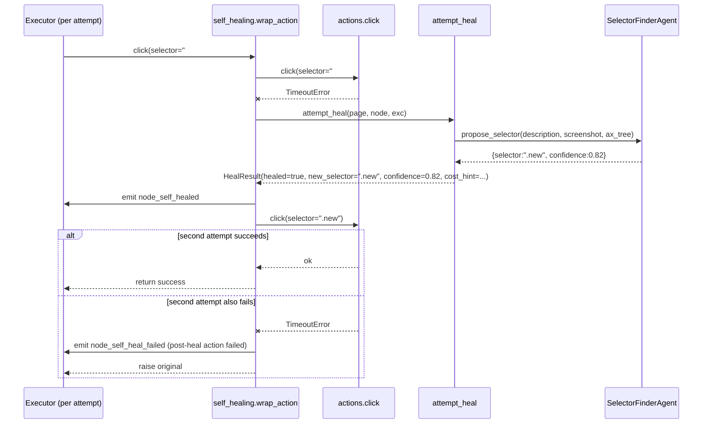
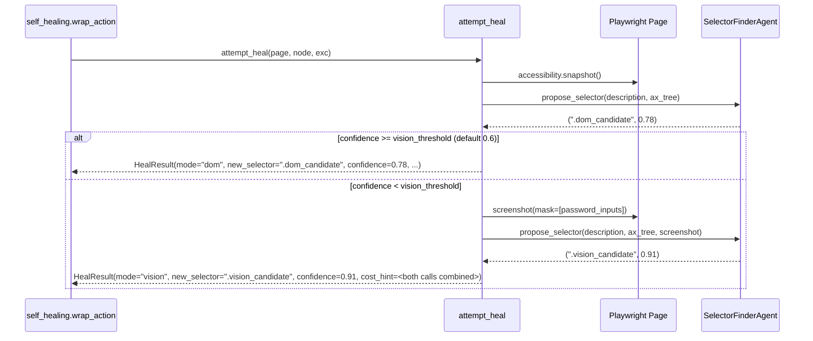

## Context

Today the executor dispatches `click` and `fill` actions directly to `app/tools/actions.py`. Each action calls `page.locator(selector).click()` (or `.fill(value)`) and lets Playwright's 30 s default timeout fire if the selector misses. The exception propagates to the executor which emits `node_failed`. There is no recovery — the action either succeeds against the original selector or kills the run (or, with `node-error-handling`, kills the attempt and triggers the retry/on-error policy).

What we add is a single recovery hop INSIDE the action call. On `playwright.async_api.TimeoutError` the wrapper takes a screenshot + accessibility snapshot of the current page, asks a tiny vision-capable LLM agent for a candidate replacement selector, retries the action with that candidate, and emits a `node_self_healed` event on success. The original action functions are unchanged; the wrapper is applied at executor-dispatch time.

The vision LLM call is the dominant cost. We use the platform's active `LlmConfig` (via `get_adk_model_cached()`) so the operator chooses the model — `gemini-2.0-flash-vision` would be the obvious default; `gpt-4o-mini` works via the LiteLlm wrapper. Plan A (`Gemini` native + `LiteLlm` for the rest) already covers both code paths.

## Goals / Non-Goals

**Goals**

- A `click` or `fill` selector miss triggers exactly one heal attempt per action invocation, no human intervention required.
- The heal step is observable via two new events; the operator sees the old + new selector and can decide whether to apply the patch.
- The original action function is unchanged — the wrapper composes around `actions.click` / `actions.fill` at dispatch time.
- Global toggle (`LlmConfig.self_healing_enabled`) and per-node override (`node.params.auto_heal`) let cost-sensitive operators opt out at the granularity they care about.
- The heal step reuses the existing active LLM; no second LLM provider configuration.
- Healed selectors are NOT silently persisted to the workflow — the operator decides via a UI button that opens the chat editor with a pre-filled patch request.

**Non-Goals**

- Selector cache learning (per-workflow + per-URL store of "last successful healed selector"). Flagged as the obvious next iteration; the events emitted here carry enough information for a future change to build the cache without re-touching the executor.
- Self-healing of non-`click` / non-`fill` actions (`navigate`, `extract`, `fuzzy_action`, `wait`, `condition`). `navigate` is URL-based, `wait` is timer-based, `fuzzy_action` is already vision-augmented, `extract` is query-based — none have the "deterministic selector miss" failure mode this change targets.
- Auto-application of the new selector to the workflow JSON. The operator must approve via the chat editor. Rationale: avoids silent workflow mutations that surprise the operator on the next run.
- Per-heal cost budgets (e.g. "no more than 10 vision calls per run"). Cost is logged via `cost_hint`; enforcement belongs to a future run-cost change.
- Heal step on a non-headed Chromium (`BROWSER_HEADLESS=true`). The wrapper works the same way; the screenshot is still taken. No special-casing.
- Heal step parallelism. Each healed action is sequential within its node; the executor's single-Chromium-tab constraint applies.

## Decisions

### Decision 1: Action wrapper at executor dispatch, not inside the action function

We considered three placements for the heal logic:

- **Inside `actions.click` / `actions.fill`** (rejected). Bloats the action functions and forces them to know about agents and screenshots. Hard to opt out at the wrapper level.
- **Inside the executor's per-node loop** (rejected). The executor would need to know which node types are "deterministic selector actions" and which are not. Couples the heal step to graph traversal rather than to action semantics.
- **A small wrapper applied at dispatch time** (chosen). `executor._dispatch(node, page, ...)` selects the action function and, for `click` / `fill`, wraps it with `services.self_healing.wrap_action(action, node, page, ...)`. The wrapper invokes the inner action; on `TimeoutError` it calls the heal service. Other actions are dispatched untouched.

```python
# backend/app/services/self_healing.py
def wrap_action(action_fn, node, page, *, emit, session):
    async def healed(*args, **kwargs):
        if not _is_enabled(node, session):
            return await action_fn(*args, **kwargs)
        try:
            return await action_fn(*args, **kwargs)
        except PlaywrightTimeoutError as original:
            result = await attempt_heal(page, node, original)
            if result.healed:
                emit("node_self_healed", node_id=node.id, payload=result.event_payload)
                # retry the action with the new selector substituted into kwargs
                new_kwargs = _substitute_selector(kwargs, result.new_selector)
                return await action_fn(*args, **new_kwargs)
            emit("node_self_heal_failed", node_id=node.id, payload=result.failure_payload)
            raise original
    return healed
```

### Decision 2: Heal step runs at most once per action attempt

Within a single action invocation the heal step is attempted exactly once. If the heal succeeds, the action retries with the new selector once. If that retry also fails, the original `TimeoutError` is re-raised (the heal event is still emitted with `healed=true` AND a subsequent `node_self_heal_failed` reason is appended noting the post-heal action failure).

When combined with `node-error-handling`, each retry attempt is an independent action invocation, so a node with `retry={max_attempts:3}` may consume up to 3 vision calls (one per attempt). This is intentional: a flaky page might heal differently each time, and re-using the previous attempt's healed selector would defeat the point of retrying.



### Decision 3: Confidence threshold before retrying the action

The agent returns a confidence in `[0, 1]`. The heal wrapper SHALL retry the action only when `confidence >= 0.5` (configurable later; hard-coded for v1). Below threshold the wrapper emits `node_self_heal_failed` with `reason: "low_confidence"` and the candidate is dropped without retrying the action. Rationale: blindly clicking the LLM's guess can destroy state (wrong button clicked, wrong field filled with sensitive value). A modest threshold catches obvious wins without high-confidence noise.

### Decision 4: `SelectorFinderAgent` uses one tool, not free-form output

We expose exactly one tool to the agent: `propose_selector(description: str) -> {selector: str, confidence: float}`. The agent's only job is to call this tool with its best guess; the tool's "implementation" inside our service simply records the call args. We then take the recorded args as the result. Rationale:

- Forces the model to output strictly-typed JSON without us writing a parser.
- Matches the existing fuzzy agent's tool-use pattern.
- Confidence is part of the tool signature, so the model cannot forget it.

### Decision 5: Two-stage heal — DOM-first, vision-fallback

The heal runs in two ordered stages within a single action invocation:

1. **DOM stage (cheap, text-only)**: `attempt_heal` first captures only `page.accessibility.snapshot()` (a JSON blob ~10–30 KB typically) and calls the `SelectorFinderAgent` with text input only. The agent returns `(selector, confidence)` and the result is tagged `mode="dom"`. If `confidence >= self_healing_vision_threshold` (default `0.6`, configurable on `LlmConfig`), the wrapper proceeds with this candidate (subject to the overall 0.5 threshold from Decision 3) and skips the vision stage entirely.
2. **Vision stage (fallback, more expensive)**: if and only if the DOM-stage confidence is below `self_healing_vision_threshold`, `attempt_heal` ALSO captures `page.screenshot(full_page=False, type="png", mask=[<password fields>])` (~50–200 KB) and re-invokes the agent with BOTH the accessibility snapshot AND the screenshot. The agent returns a (possibly different) `(selector, confidence)` and the result is tagged `mode="vision"`. The wrapper proceeds with this candidate (subject to the overall 0.5 threshold).

Both stages emit metadata so cost tracking can distinguish them. The `node_self_healed` event payload SHALL carry `mode: "dom" | "vision"`. The `cost_hint` reflects the sum of all agent calls made (so a vision-fallback heal reports the combined input tokens of both calls). Operators who want vision-always can set `self_healing_vision_threshold = 1.01` (impossible-to-meet threshold) so every heal escalates to vision. Operators who want DOM-only can set `self_healing_vision_threshold = 0.0` (always satisfied) and accept lower-confidence DOM picks.

The default `0.6` was chosen as a sensible midpoint: most accessibility snapshots are rich enough for an LLM to pick a unique candidate at ≥0.6 confidence for typical web pages; pages with poor accessibility markup escalate to vision.



### Decision 6: Settings and per-node override

```python
class LlmConfig(SQLModel, table=True):
    # ...existing...
    self_healing_enabled: bool = True
    self_healing_vision_threshold: float = Field(default=0.6, ge=0.0, le=1.0)

# node.params for click / fill nodes
class ClickParams(BaseModel):
    selector: str
    auto_heal: bool = True

class FillParams(BaseModel):
    selector: str
    value: str
    auto_heal: bool = True
```

Resolution: heal runs iff `LlmConfig.self_healing_enabled is True AND node.params.auto_heal is True`. Either off → no heal. The `self_healing_vision_threshold` controls the DOM-to-vision escalation boundary per Decision 5; default `0.6`. We considered an environment variable; rejected because the operator already manages LLM concerns through `LlmConfig` and adding a side-channel toggle splits configuration.

### Decision 7: New events emitted, NOT new run / node states

We do NOT introduce a new node state (e.g. `node_healing`). The heal happens within the action's runtime; the node moves from `node_started` → (possibly `node_self_healed`) → `node_completed`. The `node_self_healed` event is purely informational. If the post-heal action then fails, the existing `node_failed` event fires AND `node_self_heal_failed` fires with `reason: "post_heal_action_failed"`.

Event payloads:

```json
{
  "event_type": "node_self_healed",
  "node_id": "n4",
  "payload_json": {
    "original_selector": "#old",
    "new_selector": ".new",
    "confidence": 0.82,
    "mode": "dom" | "vision",
    "cost_hint": {"input_tokens": 1234, "output_tokens": 12, "vision_calls": 0 | 1}
  }
}

{
  "event_type": "node_self_heal_failed",
  "node_id": "n4",
  "payload_json": {
    "original_selector": "#old",
    "reason": "low_confidence" | "no_candidate" | "post_heal_action_failed" | "agent_error",
    "mode": "dom" | "vision",
    "agent_confidence": 0.31,
    "original_error": "TimeoutError: ...",
    "post_heal_error": "TimeoutError: ..." | null,
    "cost_hint": {"input_tokens": 1234, "output_tokens": 12, "vision_calls": 0 | 1}
  }
}
```

`mode` identifies the stage that produced the recorded `(new_selector, confidence)` pair: `"dom"` for the cheap text-only first stage, `"vision"` for the screenshot-augmented fallback. `cost_hint.vision_calls` is `0` for DOM-stage hits AND `1` for vision-fallback hits; `input_tokens` / `output_tokens` are the SUM of all agent calls made during the heal (so a vision-fallback heal aggregates both the DOM stage and the vision stage).

### Decision 8: Patch suggestion UI flow — chat prefill, no bypass endpoint

When the run log row shows a `node_self_healed` event, a small wand icon and a "采用新选择器" button are rendered next to the affected node row. Clicking the button:

1. Opens the chat panel for the workflow.
2. Pre-fills a user message: `"将节点 n4 的 selector 改为 \".new\""` (template; the node id and new selector are interpolated).
3. Sets focus to the send button (does NOT auto-send).

The operator reviews the message, optionally edits it, sends it. The editor's existing patch flow takes over: it produces an `update_node` patch that changes `params.selector`, the patch is applied atomically as a new `WorkflowVersion`. We **explicitly do NOT add a bypass endpoint** (no `apiClient.workflows.applyHeal(...)` shortcut). Rationale:

- Every workflow mutation goes through the same chat-driven audit trail, keeping the workflow history coherent.
- The editor agent can also apply additional context-sensitive tweaks (e.g. update sibling nodes that referenced the old selector via a shared variable) — a bypass endpoint would miss those.
- The cost of one editor turn is dwarfed by the cost of having two independent mutation paths to maintain and validate.

The pre-filled template wording is locked at `"将节点 <id> 的 selector 改为 \"<new>\""` to keep the editor agent's input predictable (the prompt-engineering work to map this canonical wording to an `update_node` patch is a one-shot example in the editor's system prompt).

### Decision 9: Cost hint is best-effort

The ADK response includes token counts when the underlying provider returns them. The `cost_hint` field is populated from those counts, defaulting to `{input_tokens: null, output_tokens: null, vision_calls: 1}` when unavailable. Frontend renders the field as a small icon with tooltip "本次自愈消耗 X 输入 / Y 输出 token"; the field is purely informational in this change. A future "run cost tracking" change aggregates costs across runs.

### Decision 10: Timeout for the heal call itself

The heal LLM call SHALL be wrapped in a 15 s `asyncio.wait_for`. On timeout the heal aborts, `node_self_heal_failed(reason="agent_error", original_error="agent timeout after 15s")` is emitted, and the original `TimeoutError` is re-raised. Rationale: the Playwright action's own 30 s timeout already fired; we don't want the heal step to double that into a 60 s effective wait.

## Risks / Trade-offs

- **Wrong-element heals**: the LLM picks a button that LOOKS right but is the wrong action (`提交` vs `保存`). Mitigation: 0.5 confidence threshold + emit-don't-auto-apply policy + the operator sees the patch suggestion before it lands.
- **Cost amplification under `node-error-handling`**: a flaky `click` with `retry={max_attempts:5}` could trigger 5 vision calls per failed node. Mitigation: per-node `auto_heal: false` opt-out; the global toggle; the operator can see the heal events in the run log and notice the cost pattern.
- **Vision-model availability**: if the active `LlmConfig` points at a text-only model, the agent call fails. Mitigation: the heal service detects the failure mode (provider returns "vision not supported") and emits `node_self_heal_failed(reason="agent_error")` once; subsequent failures in the same run skip the heal step entirely (in-process flag) to avoid spamming.
- **Privacy / leakage**: the screenshot may contain credentials filled by prior nodes. Mitigation: the heal service masks the contents of input fields that match `type="password"` before screenshotting (Playwright's `mask` parameter on `page.screenshot(mask=[…])`). Documented as best-effort; non-password sensitive content is the operator's responsibility.
- **Heal during abort**: the wrapper checks the abort flag before calling the LLM AND immediately after the LLM returns. An abort during the LLM call cancels the heal and re-raises the original `TimeoutError` so the executor proceeds to its abort branch.

## Migration Plan

- New `LlmConfig.self_healing_enabled` column added by SQLite `ALTER TABLE` on first boot. An idempotent helper backfills `True` for the existing row and writes marker file `backend/.self_healing_default_set` (same pattern as the other backfills in the platform).
- `node.params.auto_heal` defaults to `True` and is omitted in existing workflow JSON; pydantic deserialisation fills the default on load.
- New event types are append-only; replay players that don't know about them ignore them per the existing "unknown event type" rule.

## Resolved Decisions

The two original open questions were closed by the user before implementation:

1. **Heal strategy** → **DOM-first, vision-fallback** (see Decision 5). DOM-only first attempt uses just the accessibility snapshot; if the confidence falls below `LlmConfig.self_healing_vision_threshold` (default `0.6`), the same agent is re-invoked with a screenshot attached. The event's `mode: "dom" | "vision"` field tracks which stage produced the recorded result. This addresses the cost concern of always-vision while keeping vision available as a fallback.
2. **"采用新选择器" UI placement** → **chat prefill** (see Decision 8). NO bypass endpoint. Every workflow mutation goes through the editor agent so the audit trail stays coherent and so the editor can apply related tweaks (sibling nodes that reference the old selector). The pre-filled template wording is locked at `"将节点 <id> 的 selector 改为 \"<new>\""` and the editor's system prompt gets a one-shot example mapping this canonical wording to an `update_node` patch.

## Open Questions

All design decisions resolved as of 2026-05-15.
