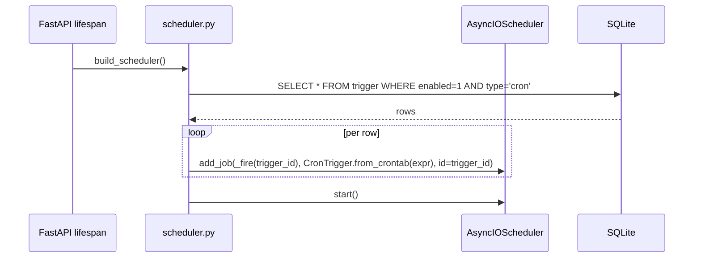
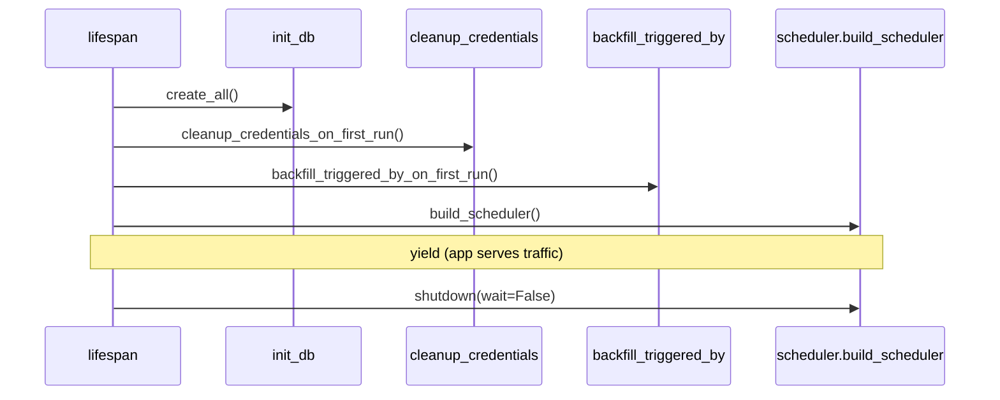

## Context

The platform change (`auto-agent-platform`) shipped a persistent `Run` table, a process-wide FIFO queue scheduler (`services.runs._scheduler`), and a single Chromium tab — exactly one `running` row at a time. Creating a `Run` row from anywhere — `POST /api/runs`, a cron tick, an inbound webhook — already feeds the same queue and the same executor.

What is missing is a way for events that are not a human button click to land a row in that queue. This change adds two of them. Both are thin glue between an external event source (a cron expression in the scheduler, an HTTP POST on a webhook URL) and the existing `services.runs.create_queued_run(workflow_id, version_id=None)` helper.

The system stays single-process, single-machine, single-user. Triggers are NOT a distributed system; APScheduler lives inside the FastAPI process and dies with it.

## Goals / Non-Goals

**Goals**

- Persist triggers per workflow with an obvious, editable shape.
- One backend-resident scheduler that reads enabled cron triggers at startup and reconciles itself on CRUD without restart.
- A single public webhook endpoint per trigger with a per-trigger secret in a query string. Secret can be regenerated.
- Every cron-fired and webhook-fired run is a normal `Run` row, visible in the existing run history, abortable via the existing abort plumbing, replayable via the existing replay UI.
- The incoming webhook body is preserved on the `Run` so later changes (`node-context-variables`) can expose it as `{{run.input.*}}`.

**Non-Goals**

- Multi-process / distributed scheduling. No Redis, no SQL job store. APScheduler with a memory job store is enough.
- Retry of a missed cron tick. If the backend is down at fire time, that tick is lost; the next tick still fires.
- Cron-side calendar logic (holiday skip, business hours). The cron expression is the only schedule.
- Webhook HMAC signing or replay protection. Query-string secret only. Documented; not a security claim for hostile networks.
- Cross-workflow trigger fan-out (one trigger → multiple workflows).
- Throttling / debouncing of cron triggers that fire while a previous run is still in the queue. The queue itself handles backpressure (every fire enqueues; the executor drains FIFO).

## Decisions

### Decision 1: APScheduler `AsyncIOScheduler` over a hand-rolled asyncio loop

We considered a tiny custom `asyncio.create_task` loop that polls cron triggers every minute. APScheduler is preferred:

- It already knows the cron syntax (uses `croniter` semantics under the hood with its `CronTrigger`), saving us from re-implementing a parser.
- It already handles "next run time after now" and DST transitions correctly.
- It's a single pinned dependency, ~150 KB, no transitive bloat.
- It integrates cleanly with `asyncio`; jobs are coroutines.

The downside (a third-party dependency on the critical path of `lifespan`) is worth the saved code volume.

### Decision 2: Memory job store, not SQL job store

APScheduler can persist its job state to SQLAlchemy. We don't use that. The source of truth is the `trigger` table. On every startup the scheduler is built fresh from the rows where `enabled=True`. On every trigger CRUD the affected job is added / removed / replaced.

Rationale: two sources of truth (APScheduler's job store + our `trigger` table) is one too many. Reconciling them on conflicts is more complex than rebuilding from the table on each event.



### Decision 3: Webhook secret is a query parameter, encrypted at rest, with a forward-compatible `auth_mode` column

```
POST /api/triggers/webhook/<path>?secret=<value>
```

Headers would be more conventional (e.g. `X-Auto-Agent-Secret`) but external systems that fire webhooks have widely inconsistent header support. Query strings are the lowest common denominator. The secret is `secrets.token_urlsafe(24)`, generated server-side, never echoed back in a list response. The `GET` response includes a `secret_masked` (`"abcd…XYZ"`) and a one-shot `secret_full` only when the trigger is first created or after `POST /api/.../regenerate-secret`.

The secret is **encrypted at rest with the existing Fernet key** (`backend/.secret_key`), mirroring the `Credential.encrypted_blob` pattern from `auto-agent-platform`. The `Trigger.secret_for_webhook` column stores the Fernet ciphertext; the plaintext lives in memory only when validating an incoming request. Constant-time comparison via `secrets.compare_digest` against the decrypted value.

To keep the door open for a future HMAC body-signing scheme without breaking the public endpoint shape, the `Trigger` row carries an `auth_mode: Literal["query_secret","hmac"] = "query_secret"` enum column. The current change implements only `"query_secret"`; any other value is rejected at validation. A future "webhook-hmac" change adds the `"hmac"` branch (secret used as the HMAC key, signature in `X-Auto-Agent-Signature` header) without touching the `Trigger` schema or the endpoint route.

We are explicit that `"query_secret"` is a single-user POC choice: anyone on the internet who learns the URL and secret can fire the run. For production we'd add HMAC signing of the body and per-trigger allowlists of source IPs. Documented as future work in proposal/Risks.

### Decision 4: Webhook path is per-trigger and globally unique

The webhook trigger row stores `schedule_or_path = "<url-safe-slug>"`. The route is `POST /api/triggers/webhook/{path}`. A unique constraint on `(type="webhook", schedule_or_path)` enforces global uniqueness. We considered scoping the path under the workflow id (`/api/triggers/webhook/{workflow_id}/{path}`) but rejected that: the operator wants the URL to look opaque, not enumerable. The path slug is generated server-side on create (default `secrets.token_urlsafe(8)`) and can be edited by the operator to a chosen string (subject to the unique constraint and a `[a-z0-9-]{3,64}` validation).

### Decision 5: Cron `last_fired_at` is wall-clock at fire time, not at job-completion time

`last_fired_at` is set BEFORE the run is enqueued, not after it completes. Rationale: the UI's "next fire" preview is more useful when based on schedule + last fire time, and a long-running workflow would otherwise make `last_fired_at` lag arbitrarily far behind reality. Run lifecycle is already tracked on the `Run` row; the trigger row only cares about scheduling.

### Decision 6: `triggered_by` is a JSON blob on `Run`, not a separate FK

A `Run` can outlive its trigger (the operator may delete the trigger after the run completes). Putting `trigger_id` as a hard FK would force ON DELETE SET NULL or block deletion. A JSON blob captures the trigger id at fire time AND the webhook body in one place, and never invalidates when the trigger row goes away. Shape:

```json
{ "kind": "manual" }
{ "kind": "cron",    "trigger_id": "trg_…" }
{ "kind": "webhook", "trigger_id": "trg_…", "body": {...}, "ip": "203.0.113.5" }
```

The body is bounded by a 64 KiB cap before persistence (oversized bodies are truncated and a marker `"truncated": true` is added; the webhook still fires the run).

### Decision 7: Lifespan reconciliation runs after `init_db()` and after `cleanup_credentials_on_first_run()`

The scheduler depends on the `trigger` table existing. It is wired into `lifespan` last among the startup hooks. On shutdown the lifespan stops the scheduler before the engine is disposed.



### Decision 8: Webhook fires use a synchronous request-response

`POST /api/triggers/webhook/{path}` returns immediately with `{run_id, status:"queued"}` (HTTP 202) once the row is in the queue. It does NOT block on run completion. This matches every webhook integration we've seen (Zapier, GitHub Actions, generic IFTTT) and keeps the public endpoint snappy regardless of the queue depth.

### Decision 9: Trigger CRUD requires the workflow to exist; no soft delete

`DELETE /api/workflows/{id}/triggers/{trigger_id}` is a hard delete (`DELETE FROM trigger WHERE id=?`). The corresponding APScheduler job (if any) is removed. There is no soft-delete or audit log; an operator who wants history can simply disable the trigger (`enabled=False`). Deleting the parent workflow cascades to its triggers via application-level cascade in `delete_workflow` (same pattern as `WorkflowCredential`).

## Risks / Trade-offs

- **Missed cron fires**: a backend that is down at fire time loses that tick. APScheduler's "misfire grace time" is set to 60 s; ticks older than that are dropped. We document this and accept it for a single-user local platform.
- **Webhook secret in URL**: query-string secrets land in `access_log`, in browser history, and in any proxy in the middle. Acceptable for a local POC; future change to add HMAC signing of the body and rotate-on-suspicion.
- **Trigger enqueues onto a full queue**: nothing prevents a cron trigger firing every minute against a workflow whose runs take 10 minutes. The queue grows. We log a `WARNING` when `queue depth for workflow X exceeds 10` once per minute but do NOT drop. The operator decides whether to disable the trigger.
- **APScheduler timezone**: jobs default to UTC. The cron editor in the UI explicitly labels the timezone (`Asia/Shanghai` by default for our user, configurable per-trigger via `Trigger.timezone` field). Persisted as IANA name.
- **Public webhook endpoint on a single-user platform**: by default the backend binds to `127.0.0.1`. Operators who want the webhook to be reachable externally must explicitly bind to `0.0.0.0` and open the firewall — there is no "secretly expose me" surprise.

## Migration Plan

1. Drop the new model + router + scheduler service.
2. On first boot: `init_db()` creates the `trigger` table and adds the `triggered_by` column to `run`. SQLite `ALTER TABLE ADD COLUMN` is safe.
3. A one-time backfill (`backfill_triggered_by_on_first_run()`) sets every existing `Run.triggered_by` to `{"kind":"manual"}` and writes marker file `backend/.triggered_by_backfilled`. Logged with a single `WARNING` line giving the row count.
4. The scheduler starts with zero cron jobs and zero webhook routes. The operator creates triggers through the UI; routes light up immediately (no restart needed).

## Resolved Decisions

The two original open questions were closed by the user before implementation. They are baked into the architecture sections above; recorded here for traceability:

1. **Scheduler** → **APScheduler** (`AsyncIOScheduler`, memory job store). The hand-rolled `croniter` polling loop was rejected to avoid re-implementing cron / DST handling. `APScheduler` bundles cron parsing, so no `croniter` dependency is needed.
2. **Webhook auth in v1** → **query-string secret**, validated via `secrets.compare_digest` against a Fernet-encrypted stored secret. A `Trigger.auth_mode: Literal["query_secret","hmac"]` enum column is reserved (defaulting to `"query_secret"`) so a future "webhook-hmac" change can introduce HMAC body signing cleanly without endpoint churn. HMAC is explicitly NOT implemented in this change.

## Open Questions

All design decisions resolved as of 2026-05-15.
